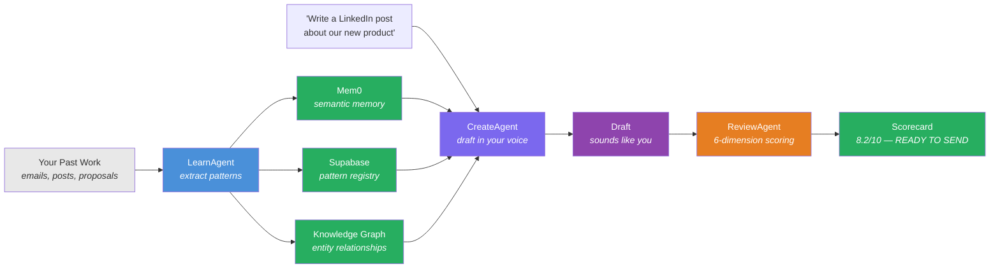
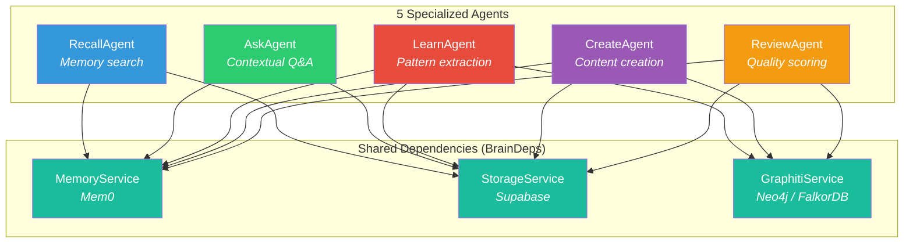
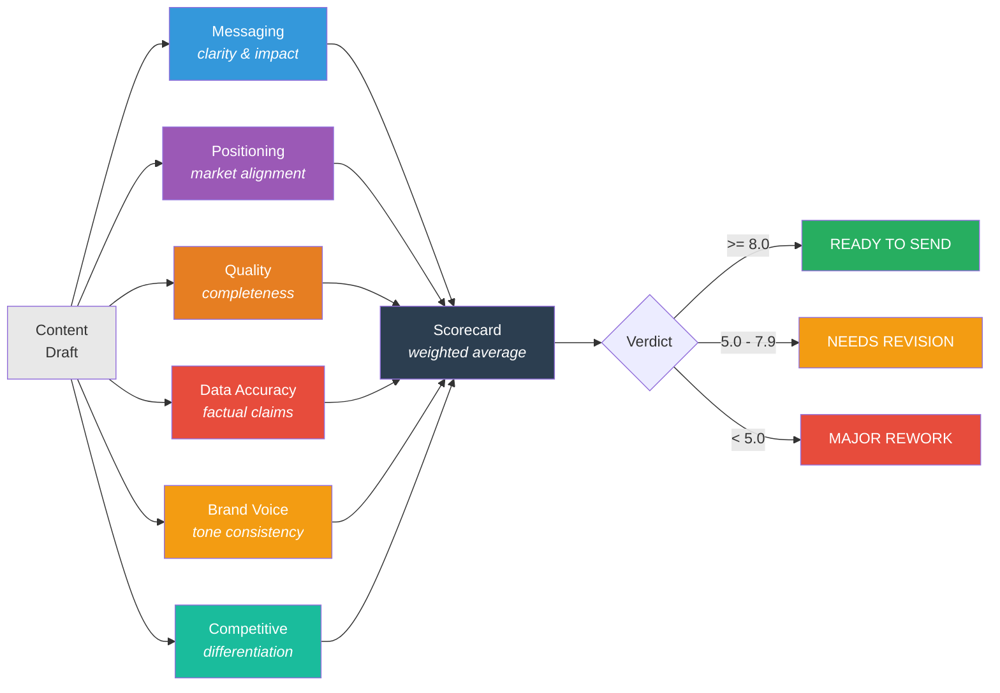
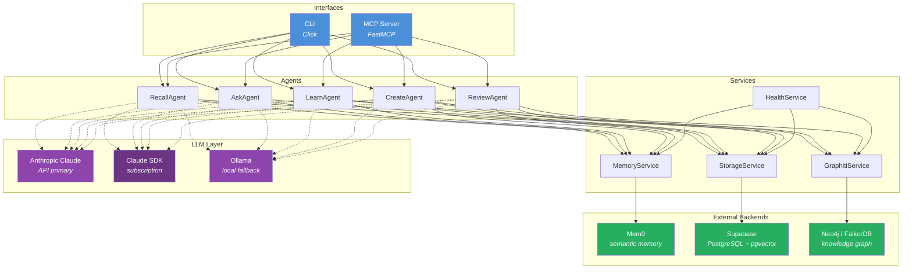
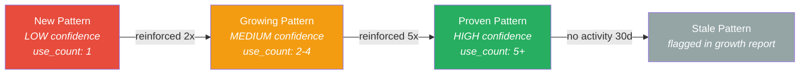
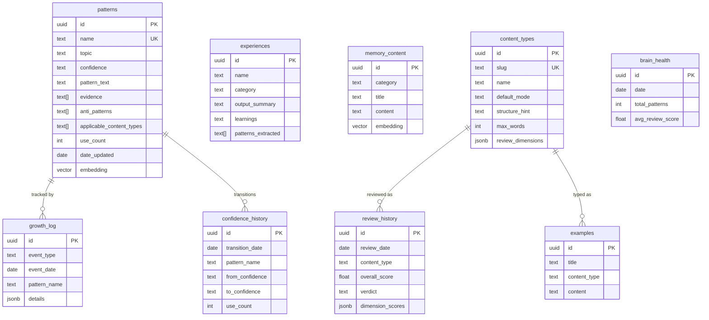
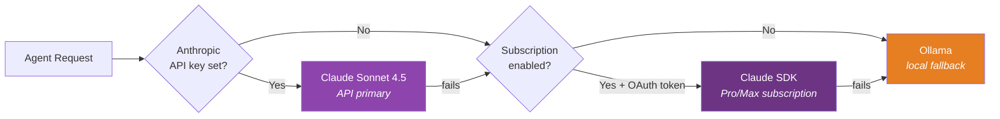

# Second Brain

**An AI copywriter that learns your voice.**

Second Brain is an AI-powered writing system built on 5 specialized agents that learn from your past work — your tone, your patterns, your wins — and produce drafts that sound like you, not a robot. Feed it examples of your best content, and it extracts patterns, builds a knowledge graph, and applies what it learns to every new draft.

[](LICENSE)
[](https://www.python.org/downloads/)
[]()

---

## How It Works

You write content every day — emails, LinkedIn posts, proposals, case studies. Your best work has patterns: specific phrasing, structural choices, tone shifts that land. Second Brain captures those patterns and uses them to generate drafts that match your voice.



The system gets smarter over time. Each piece of content you feed it reinforces existing patterns or discovers new ones. Pattern confidence grows from LOW (first seen) to MEDIUM (2-4 uses) to HIGH (5+ uses). High-confidence patterns are prioritized in future drafts.

---

## The 5 Agents

Second Brain is built on [Pydantic AI](https://ai.pydantic.dev/) with typed dependencies and structured output. Each agent has a specific job, its own tools, and returns a typed result.



### RecallAgent — Memory Search

Searches across semantic memory, the pattern registry, past experiences, and content examples. Returns ranked matches with sources and graph relationships.

**Tools**: `search_semantic_memory`, `search_patterns`, `search_experiences`, `search_examples`

```bash
brain recall "enterprise objection handling"
```

```
# Recall: enterprise objection handling

## Matches
  [HIGH] When prospects say "we already have a solution," pivot to integration...
         Source: patterns/messaging

## Related Patterns
  - Objection Bridge Technique
  - Enterprise Value Framing

## Graph Relationships
  Enterprise Sales --[requires]--> Objection Handling
  Objection Handling --[uses]--> Value Pivot
```

### AskAgent — Contextual Q&A

Answers questions using accumulated brain knowledge — company context, customer insights, patterns, and past experiences. Grounds every response in actual data.

**Tools**: `load_brain_context`, `find_relevant_patterns`, `find_similar_experiences`, `search_knowledge`

```bash
brain ask "Help me write a follow-up email to a prospect who went silent"
```

### LearnAgent — Pattern Extraction

Analyzes raw text from work sessions and extracts structured patterns. Detects duplicates, reinforces existing patterns, tracks confidence progression, and records experiences.

**Tools**: `search_existing_patterns`, `store_pattern`, `reinforce_existing_pattern`, `add_to_memory`, `store_experience`, `consolidate_memories`, `tag_graduated_memories`

```bash
brain learn "Just closed a deal with Acme Corp. The key was leading with ROI data
from our case study, then addressing their integration concerns upfront..."
```

```
# Learn: Sales session with Acme Corp

## Patterns Extracted
  [MEDIUM] ROI-Led Opening (reinforced)
           Lead with quantified outcomes before features
  [LOW] Preemptive Objection Handling (new)
        Address known concerns before the prospect raises them

## Summary
  New patterns: 1
  Reinforced: 1
```

### CreateAgent — Content Creation

Drafts content in your voice using your accumulated knowledge. Loads your voice guide, reference examples, applicable patterns, and audience context before writing.

**Tools**: `load_voice_guide`, `load_content_examples`, `find_applicable_patterns`, `load_audience_context`

```bash
brain create "Announce our new AI automation product" --type linkedin
brain create "Follow up with prospect after demo" --type email --mode professional
brain create "Q4 results for investors" --type presentation
```

```
# Draft (LinkedIn Post - casual)

Stop hiring for tasks AI can do better.

We just shipped an automation layer that handles the 40% of your team's
work that's repetitive, predictable, and soul-crushing.

Not "AI-powered." Actually automated. Set it up once, forget about it.

Three clients in beta cut their ops overhead by 35% in 60 days.

Want to see if it works for your team? Drop a comment or DM me.

---
Words: 67
Voice: direct, no-jargon, outcome-focused
Patterns: Hook-First Opening, Specific Proof Point, Soft CTA
Editor notes: Verify the 35% stat and adjust for your specific clients.
```

### ReviewAgent — Quality Scoring

Evaluates content across 6 dimensions in parallel, producing a structured scorecard with per-dimension scores, strengths, issues, and a verdict.



All 6 dimensions run as parallel agent calls using `asyncio.gather`. Custom content types can override which dimensions are enabled and their weights.

```bash
brain review "Your draft text here" --type linkedin
```

```
# Review: 8.2/10 — READY TO SEND

## Scores by Dimension
  Messaging            9/10  [pass]
  Positioning          8/10  [pass]
  Quality              8/10  [pass]
  Data Accuracy        7/10  [pass]
  Brand Voice          9/10  [pass]
  Competitive          8/10  [pass]

## Strengths
  - Strong opening hook that creates urgency
  - Specific proof point (35% reduction) builds credibility
  - Voice matches established casual-direct tone

## Next Steps
  - Verify the 35% statistic before publishing
```

---

## Architecture



### Data Flow

```
User Request → CLI or MCP → Agent.run(deps=BrainDeps) → Agent Tools → Services → Backends
                                                                                     ↓
User ← Formatted Output ← Typed Result (Pydantic) ← Agent ← Tool Results ← Mem0 / Supabase / Neo4j
```

### Layers

| Layer | What | Files |
|-------|------|-------|
| **Config** | Loads `.env`, resolves LLM provider, OAuth auth | `config.py`, `models.py`, `models_sdk.py`, `auth.py` |
| **Services** | Wraps external backends with error handling | `services/memory.py`, `services/storage.py`, `services/graphiti.py`, `services/health.py` |
| **Agents** | Pydantic AI agents with typed deps and tools | `agents/recall.py`, `agents/ask.py`, `agents/learn.py`, `agents/create.py`, `agents/review.py` |
| **Interfaces** | CLI (Click) and MCP server (FastMCP) | `cli.py`, `mcp_server.py` |

### Dependency Injection

All agents share a single `BrainDeps` dataclass created once and passed to every `agent.run()` call:

```python
@dataclass
class BrainDeps:
    config: BrainConfig
    memory_service: MemoryService
    storage_service: StorageService
    graphiti_service: GraphitiService | None = None
    content_type_registry: ContentTypeRegistry | None = None
```

---

## 9 Content Types (Extensible)

Second Brain ships with 9 built-in content types, each with a default communication mode, structure hint, and word target. You can add custom types via CLI or MCP.

| Slug | Name | Mode | Words | Structure |
|------|------|------|-------|-----------|
| `linkedin` | LinkedIn Post | casual | 300 | Hook -> Body -> CTA |
| `email` | Professional Email | professional | 500 | Subject -> Opening -> Body -> Closing |
| `landing-page` | Landing Page | professional | 1000 | Headline -> Problem -> Solution -> Proof -> CTA |
| `comment` | Comment/Reply | casual | 150 | Acknowledgment -> Insight -> Question |
| `case-study` | Case Study | professional | 1500 | Context -> Challenge -> Approach -> Results -> Takeaways |
| `proposal` | Sales Proposal | professional | 2000 | Summary -> Problem -> Solution -> Deliverables -> Investment |
| `one-pager` | One-Pager | professional | 500 | Headline -> Problem -> Solution -> Benefits -> CTA |
| `presentation` | Presentation Script | professional | 800 | Hook -> Key Points -> Data -> Messaging -> CTA |
| `instagram` | Instagram Post | casual | 200 | Hook -> Story -> CTA -> Hashtags |

```bash
# Add a custom content type
brain types add newsletter "Weekly Newsletter" \
  --structure "Subject -> Intro -> 3 Sections -> CTA" \
  --max-words 800

# List all types
brain types list
```

---

## Memory System

Second Brain uses a three-layer memory architecture. Each layer serves a different purpose and they work together to give agents comprehensive context.

```mermaid
graph TD
    subgraph "Layer 1: Semantic Memory (Mem0)"
        SM["Auto-extracted facts<br/><i>Searchable by meaning</i>"]
        GR["Graph Relationships<br/><i>Entity connections</i>"]
    end

    subgraph "Layer 2: Structured Storage (Supabase)"
        PAT["Pattern Registry<br/><i>Confidence tracking</i>"]
        EXP["Experiences<br/><i>Past work sessions</i>"]
        EX["Examples<br/><i>Reference content</i>"]
        MC["Memory Content<br/><i>Company / audience / voice</i>"]
        CT["Content Types<br/><i>Dynamic registry</i>"]
        GL["Growth Log<br/><i>Brain evolution</i>"]
        RH["Review History<br/><i>Quality trends</i>"]
        CH["Confidence History<br/><i>Pattern progression</i>"]
    end

    subgraph "Layer 3: Knowledge Graph (Optional)"
        GI["Graphiti<br/><i>Neo4j or FalkorDB</i>"]
        ENT["Entities & Relations<br/><i>Deep connections</i>"]
    end

    SM --> PAT
    GR --> ENT
    GI --> ENT

    style SM fill:#4a90d9,color:#fff
    style GR fill:#4a90d9,color:#fff
    style PAT fill:#27ae60,color:#fff
    style EXP fill:#27ae60,color:#fff
    style EX fill:#27ae60,color:#fff
    style MC fill:#27ae60,color:#fff
    style CT fill:#27ae60,color:#fff
    style GL fill:#27ae60,color:#fff
    style RH fill:#27ae60,color:#fff
    style CH fill:#27ae60,color:#fff
    style GI fill:#e67e22,color:#fff
    style ENT fill:#e67e22,color:#fff
```



**Semantic Memory (Mem0)** — Stores facts extracted automatically from conversations and content. Supports cloud (MemoryClient) and local (Memory) backends. Searchable by meaning, not just keywords. Optional graph relationships track entity connections.

**Structured Storage (Supabase)** — PostgreSQL with pgvector for structured data. Patterns have confidence levels and use counts. Experiences record past work sessions with outcomes. Examples store reference content by type. Memory content holds company, audience, and voice guide data.

**Knowledge Graph (Graphiti)** — Optional deep relationship layer using Neo4j or FalkorDB. Agents dual-write to both Mem0 and Graphiti for entity extraction. Provides graph traversal for discovering non-obvious connections between patterns, experiences, and content.

### Pattern Lifecycle



Patterns are the core learning primitive. They're extracted from work sessions, stored with evidence and anti-patterns, and reinforced automatically when the same pattern appears again. The growth report tracks pattern creation, reinforcement, confidence upgrades, and staleness.

### Memory Graduation Pipeline

Accumulated raw memories in Mem0 can be promoted to structured patterns via the consolidation pipeline:

```bash
brain consolidate --min-cluster 3
```

The LearnAgent scans uncategorized memories, clusters recurring themes, and either creates new patterns or reinforces existing ones. Graduated memories are tagged to prevent re-processing.

---

## Database Schema

5 SQL migrations create the Supabase schema:



---

## LLM Fallback Chain

Second Brain supports three LLM backends with automatic fallback. It tries them in order until one works:



| Priority | Backend | Auth | Cost |
|----------|---------|------|------|
| 1 | **Anthropic API** | `ANTHROPIC_API_KEY` | Pay-per-token |
| 2 | **Claude SDK** (subscription) | Claude Pro/Max OAuth token | Included in subscription |
| 3 | **Ollama** (local) | None | Free (local GPU) |

### Using Claude Pro/Max Subscription (No API Key Needed)

If you have a Claude Pro or Max subscription, you can run Second Brain without spending API credits. The Claude SDK routes LLM calls through your subscription via the Claude CLI.

**Prerequisites:**
1. Active [Claude Pro or Max](https://claude.ai/settings) subscription
2. [Claude CLI](https://docs.anthropic.com/en/docs/claude-code) installed and authenticated (`claude` command works)
3. `claude-agent-sdk` Python package

**Setup:**

```bash
# 1. Install the Claude Agent SDK
pip install claude-agent-sdk

# 2. Verify Claude CLI is authenticated
claude --version

# 3. Enable subscription mode in .env
```

Add to your `.env`:

```env
USE_SUBSCRIPTION=true
# No ANTHROPIC_API_KEY needed!
```

That's it. Second Brain will automatically detect your OAuth token from the Claude CLI credential store and route all LLM calls through your subscription.

**How it works:** The `ClaudeSDKModel` wraps `claude-agent-sdk` as a Pydantic AI Model. When an agent makes an LLM call, it spawns a Claude CLI subprocess with a service MCP server that gives it access to your memory, patterns, and storage — all authenticated through your existing subscription.

**CLI flag:** You can also enable subscription mode per-command:

```bash
brain -s recall "content patterns"
brain -s create "Write a LinkedIn post" --type linkedin
```

Both models are configurable via `.env`:

```env
PRIMARY_MODEL=anthropic:claude-sonnet-4-5
FALLBACK_MODEL=ollama:llama3.1:8b
OLLAMA_BASE_URL=http://localhost:11434
```

---

## Two Interfaces

### CLI (Click)

Full command-line interface for all brain operations:

```bash
# Memory search
brain recall "content writing patterns"

# Contextual Q&A
brain ask "What's our positioning for enterprise clients?"

# Pattern extraction
brain learn "Paste your work session notes here" --category content

# Content creation
brain create "Write about our Q4 results" --type email --mode professional

# Quality review
brain review "Your draft text" --type linkedin

# Brain health
brain health
brain growth --days 30

# Content types
brain types list
brain types add blog-post "Blog Post" --structure "Title -> Intro -> Body -> Conclusion" --max-words 1500

# Knowledge graph
brain graph health
brain graph search "customer objections"

# Memory consolidation
brain consolidate --min-cluster 3

# Data migration
brain migrate
```

### MCP Server (FastMCP)

Exposes all agents as tools callable from Claude Code or any MCP-compatible client:

| Tool | What It Does |
|------|-------------|
| `recall` | Search semantic memory, patterns, experiences |
| `ask` | Contextual Q&A with brain knowledge |
| `learn` | Extract patterns from raw text |
| `create_content` | Draft content in your voice |
| `review_content` | 6-dimension quality scoring |
| `search_examples` | Browse reference content |
| `search_knowledge` | Search frameworks and methodologies |
| `brain_health` | Brain health metrics |
| `growth_report` | Growth tracking over time |
| `graph_search` | Knowledge graph traversal |
| `consolidate_brain` | Memory-to-pattern graduation |
| `list_content_types` | Available content types |
| `manage_content_type` | Add/remove content types |
| `delete_item` | Remove patterns, experiences, examples |

```bash
# Start the MCP server
python -m second_brain.mcp_server
```

---

## Quick Start

### Prerequisites

- Python 3.11+
- A Supabase project (free tier works)
- An OpenAI API key (for Mem0 embeddings — uses `text-embedding-3-small`)
- **One of**: Anthropic API key, Claude Pro/Max subscription, or Ollama for local inference

### Install

```bash
git clone <repo-url>
cd second-brain
pip install -e ".[dev]"
```

### Configure

Create a `.env` file:

```env
# Required
SUPABASE_URL=https://your-project.supabase.co
SUPABASE_KEY=your-anon-key
BRAIN_DATA_PATH=C:\path\to\your\markdown\data

# LLM (pick one)
ANTHROPIC_API_KEY=sk-ant-...   # Option A: API key (pay-per-token)
USE_SUBSCRIPTION=true          # Option B: Claude Pro/Max (no API key needed)
# Option C: Ollama only (no keys needed, local GPU)

OPENAI_API_KEY=sk-...          # For Mem0 embeddings (always required)

# Optional: Mem0 Cloud
MEM0_API_KEY=m0-...

# Optional: Knowledge Graph
GRAPHITI_ENABLED=true
NEO4J_URL=neo4j+s://xxx.databases.neo4j.io
NEO4J_USERNAME=neo4j
NEO4J_PASSWORD=...

# Optional: FalkorDB (Graphiti fallback)
FALKORDB_URL=falkor://localhost:6379
```

### Set Up Database

Run the SQL migrations in your Supabase SQL Editor, in order:

1. `supabase/migrations/001_initial_schema.sql` — Core tables (patterns, experiences, memory_content, brain_health)
2. `supabase/migrations/002_examples_knowledge.sql` — Examples and knowledge repo
3. `supabase/migrations/003_pattern_constraints.sql` — Pattern name uniqueness and content type columns
4. `supabase/migrations/004_content_types.sql` — Dynamic content type registry
5. `supabase/migrations/005_growth_tracking_tables.sql` — Growth log, review history, confidence history

### Verify

```bash
# Check package
python -c "from second_brain import __version__; print(f'v{__version__}')"

# Check config
python -c "from second_brain.config import BrainConfig; print('Config OK')"

# Check agents
python -c "from second_brain.agents import recall_agent, ask_agent; print('Agents OK')"

# Run tests
python -m pytest tests/ -v

# Check brain health
brain health
```

### Migrate Existing Content

If you have markdown content organized in folders:

```bash
brain migrate
```

This reads your `BRAIN_DATA_PATH` directory and ingests content into Mem0 and Supabase.

---

## Project Structure

```
src/second_brain/
├── __init__.py              # Package init, __version__
├── config.py                # BrainConfig (Pydantic Settings, loads .env)
├── models.py                # get_model() — LLM provider factory (Claude -> SDK -> Ollama)
├── models_sdk.py            # ClaudeSDKModel — Pydantic AI Model wrapping claude-agent-sdk
├── auth.py                  # OAuth token reader (env, credentials file, keychain)
├── service_mcp.py           # Service MCP server — SDK subprocess data bridge
├── deps.py                  # BrainDeps dataclass — injected into all agents
├── schemas.py               # Pydantic output models (RecallResult, CreateResult, etc.)
├── cli.py                   # Click CLI — 15 commands across 3 groups
├── mcp_server.py            # FastMCP server — 14 tools for Claude Code
├── migrate.py               # Markdown -> Mem0 + Supabase migration tool
├── agents/
│   ├── recall.py            # RecallAgent — semantic memory search
│   ├── ask.py               # AskAgent — contextual Q&A with brain knowledge
│   ├── learn.py             # LearnAgent — pattern extraction + consolidation
│   ├── create.py            # CreateAgent — content creation in your voice
│   └── review.py            # ReviewAgent — 6-dimension parallel scoring
└── services/
    ├── memory.py            # MemoryService — Mem0 wrapper (cloud + local)
    ├── storage.py           # StorageService — Supabase CRUD + ContentTypeRegistry
    ├── health.py            # HealthService — brain health + growth metrics
    ├── graphiti.py          # GraphitiService — graph memory (Neo4j / FalkorDB)
    └── search_result.py     # SearchResult dataclass — typed Mem0 results

tests/                       # 411 tests
├── conftest.py              # Shared fixtures (including subscription auth)
├── test_agents.py           # Agent schema + tool registration
├── test_auth.py             # OAuth token reading + validation (20 tests)
├── test_cli.py              # CLI command tests
├── test_config.py           # Config validation (including subscription)
├── test_graph.py            # Graphiti integration tests
├── test_graphiti_service.py # GraphitiService unit tests
├── test_mcp_server.py       # MCP tool tests
├── test_migrate.py          # Migration tests
├── test_models.py           # LLM model resolution
├── test_models_sdk.py       # ClaudeSDKModel + fallback chain (14 tests)
├── test_service_mcp.py      # Service MCP bridge tools (11 tests)
└── test_services.py         # MemoryService + StorageService

supabase/migrations/         # 5 SQL migration files
scripts/                     # Utility scripts
```

---

## Tech Stack

| Component | Technology | Purpose |
|-----------|-----------|---------|
| **Agent Framework** | [Pydantic AI](https://ai.pydantic.dev/) | Typed deps, structured output, tool definitions |
| **Semantic Memory** | [Mem0](https://mem0.ai/) | Auto fact extraction, semantic search, graph relations |
| **Structured Storage** | [Supabase](https://supabase.com/) | PostgreSQL + pgvector for patterns, experiences, metrics |
| **Knowledge Graph** | [Graphiti](https://github.com/getzep/graphiti) | Entity extraction, graph traversal (Neo4j / FalkorDB) |
| **Primary LLM** | Anthropic Claude | Agent reasoning and content generation |
| **Subscription LLM** | [Claude Agent SDK](https://pypi.org/project/claude-agent-sdk/) | Route LLM calls through Claude Pro/Max subscription |
| **Fallback LLM** | Ollama | Local inference when no API key |
| **MCP Server** | [FastMCP](https://github.com/jlowin/fastmcp) | Expose agents as Claude Code tools |
| **CLI** | [Click](https://click.palletsprojects.com/) | Command-line interface |
| **Config** | [Pydantic Settings](https://docs.pydantic.dev/latest/concepts/pydantic_settings/) | `.env` file loading, validation |
| **Testing** | pytest + pytest-asyncio | 411 tests, async support |

---

## License

This project is licensed under the [MIT License](LICENSE).
