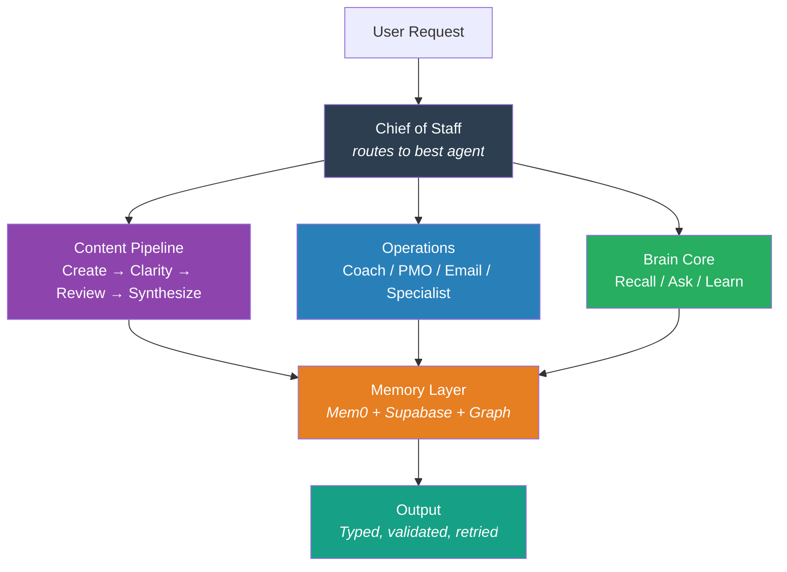
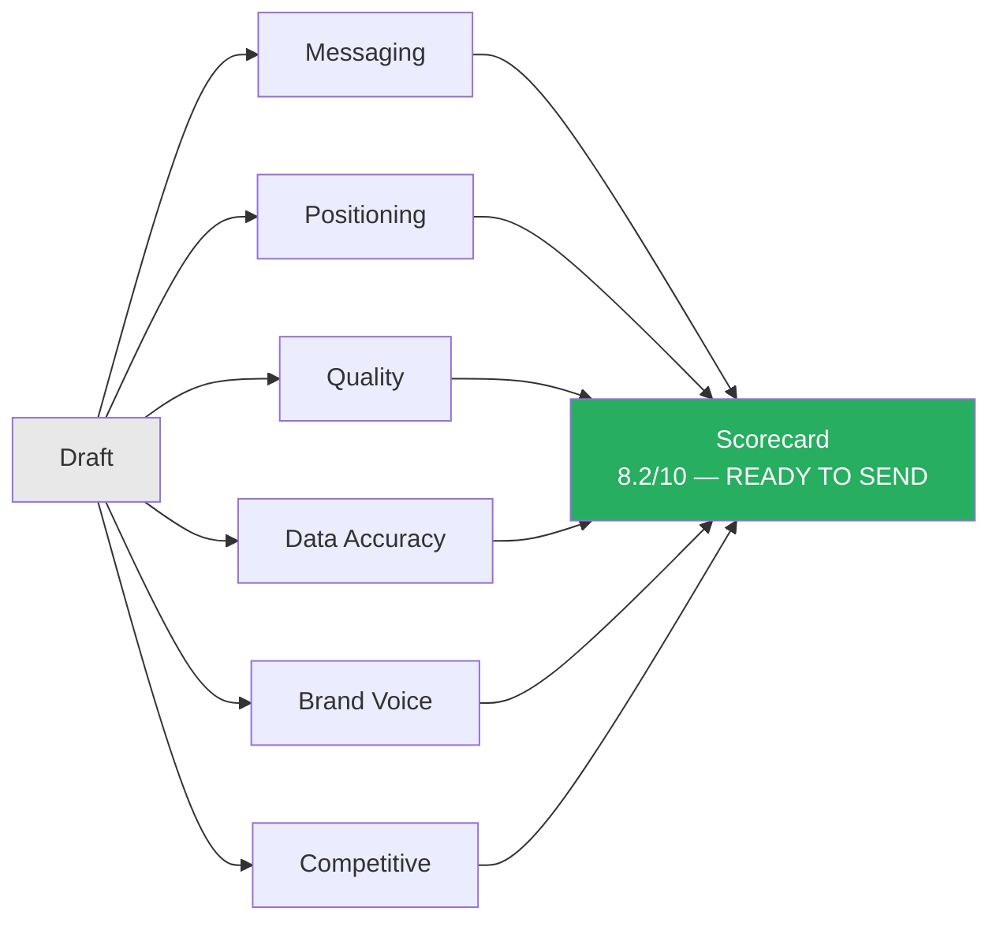
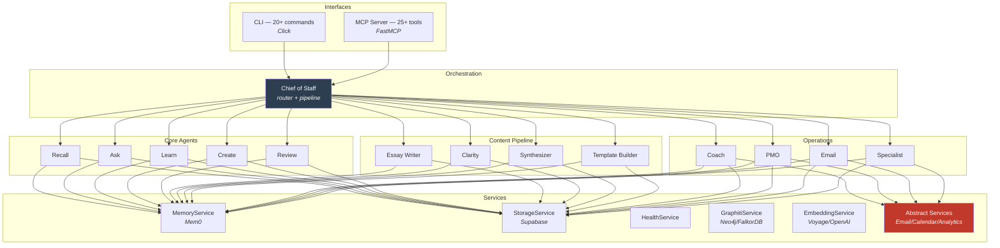
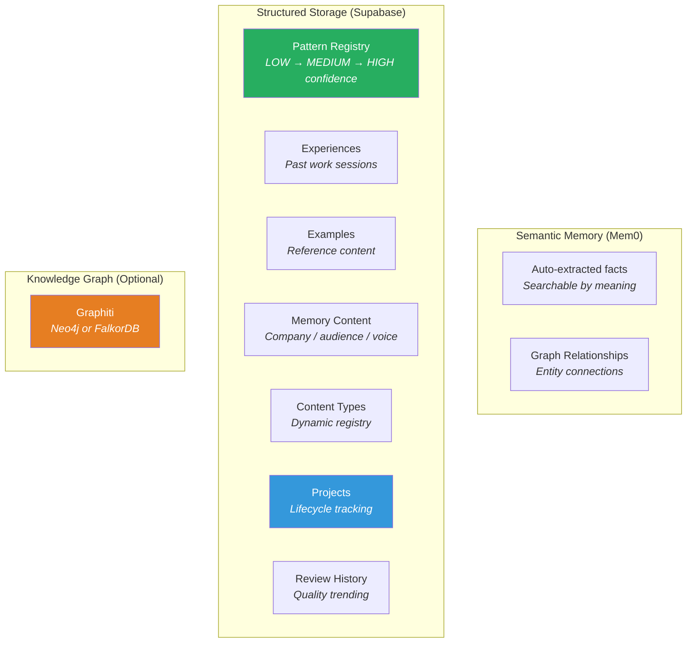

# Second Brain

**An agentic AI system that learns your voice, manages your work, and gets smarter every session.**

Second Brain is a 14-agent Pydantic AI system built around a single principle: your accumulated knowledge should make every output better. Feed it your past work, coaching notes, business context, and patterns — and it applies all of it automatically, every time.

[](LICENSE)
[](https://www.python.org/downloads/)
[]()

---

## What It Does

Most AI tools start fresh every session. Second Brain doesn't. It maintains a persistent knowledge layer — semantic memory, a pattern registry, a knowledge graph — and every agent taps into it before responding.

Write content? It loads your voice guide, past examples, and proven patterns first. Plan your day? It knows your goals, projects, and past sessions. Ask a technical question? It searches your knowledge base and cites sources with verified confidence levels.

The system also self-corrects. Every agent uses output validators with `ModelRetry` — if the first attempt doesn't meet quality criteria, the agent receives specific feedback and retries up to 3 times before returning the result.



---

## 14 Agents

Second Brain is built on [Pydantic AI](https://ai.pydantic.dev/) with typed dependencies, structured output, and `@output_validator` loops. All agents share a single `BrainDeps` dataclass injected at runtime.

### Orchestration

#### Chief of Staff — Router & Orchestrator

The Chief of Staff routes any request to the right specialist and runs multi-agent pipelines. It knows all 13 specialist agents and their capabilities.

```bash
brain route "Help me plan today and write a LinkedIn post about it"
# → routes to coach for planning, then create for the post
```

```bash
brain pipeline "my draft" --steps create,clarity,review,synthesizer
# → multi-step content improvement pipeline
```

**How routing works**: The Chief of Staff calls `get_agent_registry()` to load all available agents, reads the request, and delegates via agent-as-tool pattern — passing `ctx.deps` and `ctx.usage` for token aggregation across the full pipeline.

---

### Brain Core (5 agents)

#### RecallAgent — Memory Search

Searches across semantic memory, patterns, experiences, and content examples. Results reranked with Voyage `rerank-2-lite` for relevance ordering.

**Tools**: `search_semantic_memory`, `search_patterns`, `search_experiences`, `search_examples`

```bash
brain recall "enterprise objection handling"
```

#### AskAgent — Contextual Q&A

Answers questions grounded in accumulated brain knowledge. Loads company context, customer insights, patterns, and past experiences before responding.

**Tools**: `load_brain_context`, `find_relevant_patterns`, `find_similar_experiences`, `search_knowledge`

```bash
brain ask "What's our positioning for enterprise clients?"
```

#### LearnAgent — Pattern Extraction

Analyzes raw text and extracts structured patterns. Detects duplicates, reinforces existing patterns, tracks confidence progression, and records experiences. Triggers a review-learn pipeline on completed work.

**Tools**: `search_existing_patterns`, `store_pattern`, `reinforce_existing_pattern`, `add_to_memory`, `store_experience`, `consolidate_memories`, `tag_graduated_memories`

```bash
brain learn "Just closed a deal with Acme Corp. Led with ROI data from the case study..."
```

#### CreateAgent — Content Creation

Drafts content in your voice. Loads your voice guide, examples, patterns, and audience context before writing. Validates the draft before returning — word count, structure, completeness.

**Tools**: `load_voice_guide`, `load_content_examples`, `find_applicable_patterns`, `load_audience_context`, `validate_draft`

```bash
brain create "Announce our new AI automation product" --type linkedin
brain create "Follow up with prospect after demo" --type email --mode professional
```

#### ReviewAgent — Quality Scoring

Evaluates content across 6 dimensions in parallel using `asyncio.gather`. Returns a structured scorecard with per-dimension scores, strengths, issues, and a verdict.



```bash
brain review "Your draft text here" --type linkedin
```

---

### Content Pipeline (4 agents)

These four agents form a quality loop: write → analyze → synthesize → template.

#### Essay Writer — Long-Form Content

Creates essays using the STIRC angle evaluation protocol and Five Writing Laws. Scores every angle on Surprising/True/Important/Relevant/Cool (threshold 18/25). Validates word count (100+ minimum), title presence, and STIRC score before returning.

**Tools**: `load_voice_and_patterns`, `load_examples`, `search_research_context`

```bash
brain essay "Why most productivity advice fails knowledge workers"
brain essay "The case for async-first communication" --framework argumentative
```

#### Clarity Maximizer — Readability Analysis

Finds comprehension barriers — jargon, complexity, density, abstraction — and ranks them CRITICAL/HIGH/MEDIUM/LOW. Every finding must include a specific improvement suggestion (not "improve clarity" but the exact replacement text). Auto-computes `critical_count` from findings.

**Tools**: `load_audience_context`, `load_voice_reference`

```bash
brain clarity "Paste your draft here for readability analysis"
```

#### Feedback Synthesizer — Finding Consolidation

Takes 30–50 individual review findings and collapses them into 4–8 actionable themes with priority, effort estimates (minutes), and dependencies. Validates theme count (too few = not synthesized, too many = not consolidated). Auto-computes `implementation_hours`.

**Tools**: `load_past_reviews`

```bash
brain synthesize "Finding 1: Weak opening... Finding 2: Undefined acronym ROI..."
```

#### Template Builder — Pattern Capture

Analyzes deliverables for reusable structures. Applies the "third time is the template" principle. Every identified template must specify `when_to_use` (and when NOT to use) and a concrete `structure`. Auto-computes `templates_created`.

**Tools**: `search_existing_patterns`, `search_examples`

```bash
brain templates "Subject: Following up on our demo\n\nHi Sarah, ..."
```

---

### Operations (4 agents)

#### Daily Accountability Coach

Plans productive days through strategic prioritization and therapeutic coaching. Supports morning planning, evening review, check-ins, and intervention sessions. Scales coaching depth from surface (energy check) to identity (values alignment). Integrates with CalendarService and TaskManagementService when configured — tools are hidden via `prepare=` when services aren't available.

**Tools**: `load_goals_context`, `search_past_sessions`, `check_calendar`*, `create_time_block`*, `get_task_backlog`*
*(conditional on service availability)*

```bash
brain coach "Help me plan my day" --session-type morning
brain coach "I'm stuck on the proposal" --session-type intervention
```

#### PMO Advisor — Priority Scoring

Scores tasks using a multi-factor algorithm (Urgency 35%, Impact 25%, Effort 15%, Alignment 15%, Momentum 10%). Auto-categorizes into Today Focus (≥75), This Week (60–74), and Backlog (<60). Quick wins are tasks with effort ≤ 3 regardless of score. Provides conversational coaching alongside the data.

**Tools**: `load_strategic_context`, `get_scoring_weights`

```bash
brain prioritize "Task 1: Write proposal for Acme. Task 2: Fix staging bug. Task 3: Prep Q4 review..."
```

#### Email Agent — Composition & Management

Drafts emails in your brand voice using voice guide, past examples, and email history when EmailService is configured. Enforces draft-first safety — `send` actions are forced to `status="draft"` until you approve. Email history search and send are gated behind EmailService availability via `prepare=`.

**Tools**: `load_email_voice`, `search_email_history`*, `send_email`*
*(conditional on email service)*

```bash
brain email "Follow up with Sarah at Acme who went silent after the demo"
```

#### Claude Code Specialist — Verified Technical Answers

Provides accurate, sourced answers about Claude Code, Pydantic AI, and second brain architecture. Mandatory Truth & Attribution Protocol: cite source with file path or URL, state confidence (VERIFIED/LIKELY/UNCERTAIN), and never guess. `VERIFIED` answers without sources trigger a `ModelRetry`.

**Tools**: `search_codebase_knowledge`, `search_patterns_for_answer`

```bash
brain specialist "How does agent-as-tool delegation work in Pydantic AI?"
```

---

## Architecture



### Agentic Patterns

**Output Validators with ModelRetry** — Every agent validates its own output and retries with specific feedback. Example from Essay Writer:

```python
@essay_writer_agent.output_validator
async def validate_essay(ctx: RunContext[BrainDeps], output: EssayResult) -> EssayResult:
    if len(output.essay.split()) < 100:
        raise ModelRetry("Essay is too short. Write the complete essay, not a summary.")
    if output.stirc_score > 0 and output.stirc_score < ctx.deps.config.stirc_threshold:
        raise ModelRetry(f"STIRC score {output.stirc_score} below threshold. Find a stronger angle.")
    output.word_count = len(output.essay.split())  # auto-compute
    return output
```

**Agent-as-Tool Delegation** — Chief of Staff delegates to specialists via Pydantic AI's agent-as-tool pattern, passing `ctx.usage` for unified token accounting:

```python
@chief_of_staff_agent.tool
async def delegate_to_specialist(ctx: RunContext[BrainDeps], agent_name: str, request: str) -> str:
    registry = get_agent_registry()
    agent, _ = registry[agent_name]
    result = await agent.run(request, deps=ctx.deps, usage=ctx.usage)
    return str(result.output)
```

**Conditional Tool Availability via `prepare`** — Operations agents with external service dependencies hide tools when services aren't configured:

```python
async def _calendar_available(ctx: RunContext[BrainDeps], tool_def: ToolDefinition) -> ToolDefinition | None:
    return tool_def if ctx.deps.calendar_service else None

@coach_agent.tool(prepare=_calendar_available)
async def check_calendar(ctx: RunContext[BrainDeps], date: str = "") -> str:
    # Only visible to the LLM when CalendarService is configured
    ...
```

**Dynamic Instructions** — Agents inject live data into their system prompt at request time:

```python
@learn_agent.instructions
async def inject_existing_patterns(ctx: RunContext[BrainDeps]) -> str:
    patterns = await ctx.deps.storage_service.get_patterns()
    names = [p["name"] for p in patterns[:ctx.deps.config.pattern_context_limit]]
    return f"Existing patterns: {', '.join(names)}"
```

---

## Memory System

Three-layer memory architecture:



### Voyage AI Embeddings + Reranking

**Embeddings (`voyage-4-lite`)** — 1024-dimensional vectors for Supabase pgvector search. Falls back to OpenAI `text-embedding-3-small` (1536d) if only `OPENAI_API_KEY` is set.

**Reranking (`rerank-2-lite`)** — Cross-encoder applied after Mem0 semantic search in RecallAgent, AskAgent, and CreateAgent. Degrades gracefully when unavailable.

```
Query → Mem0 Search (semantic) → Voyage Rerank (cross-encoder) → Agent gets top-K results
```

### Pattern Lifecycle

```
New Pattern [LOW, count: 1] → reinforced 2x → Growing [MEDIUM, 2-4] → reinforced 5x → Proven [HIGH, 5+]
```

High-confidence patterns are prioritized in all agent context loading.

### Project Lifecycle Tracking

```
planning → executing → reviewing → learning → complete
```

Agents can create, search, and update projects. The Learn agent links patterns and experiences to projects. The Review agent tracks quality trends per project.

---

## Abstract Service Interfaces

Operations agents use abstract service interfaces for external APIs. Build the agent logic now, wire real implementations when the APIs are ready.

```python
# services/abstract.py
class EmailServiceBase(ABC):
    async def send(self, to: list[str], subject: str, body: str) -> dict: ...
    async def search(self, query: str, limit: int = 10) -> list[dict]: ...

class CalendarServiceBase(ABC):
    async def get_events(self, date: str) -> list[dict]: ...
    async def create_event(self, summary: str, start: str, end: str, ...) -> dict: ...

class AnalyticsServiceBase(ABC):
    async def query(self, sql: str) -> list[dict]: ...
    async def get_revenue(self, period_days: int) -> dict: ...

class TaskManagementServiceBase(ABC):
    async def get_tasks(self, limit: int = 20) -> list[dict]: ...
```

Stub implementations are included. When agents check `ctx.deps.email_service is None`, tools are hidden from the LLM entirely via `prepare=`.

---

## 9 Built-In Content Types (Extensible)

| Slug | Name | Mode | Words | Structure |
|------|------|------|-------|-----------|
| `linkedin` | LinkedIn Post | casual | 300 | Hook → Body → CTA |
| `email` | Professional Email | professional | 500 | Subject → Opening → Body → Closing |
| `landing-page` | Landing Page | professional | 1000 | Headline → Problem → Solution → Proof → CTA |
| `comment` | Comment/Reply | casual | 150 | Acknowledgment → Insight → Question |
| `case-study` | Case Study | professional | 1500 | Context → Challenge → Approach → Results → Takeaways |
| `proposal` | Sales Proposal | professional | 2000 | Summary → Problem → Solution → Deliverables → Investment |
| `one-pager` | One-Pager | professional | 500 | Headline → Problem → Solution → Benefits → CTA |
| `presentation` | Presentation Script | professional | 800 | Hook → Key Points → Data → Messaging → CTA |
| `instagram` | Instagram Post | casual | 200 | Hook → Story → CTA → Hashtags |

```bash
brain types add newsletter "Weekly Newsletter" --structure "Subject -> Intro -> 3 Sections -> CTA"
```

---

## LLM Fallback Chain

```
Anthropic API (ANTHROPIC_API_KEY) → Claude SDK (Pro/Max subscription) → Ollama (local)
```

| Priority | Backend | Auth | Cost |
|----------|---------|------|------|
| 1 | Anthropic API | `ANTHROPIC_API_KEY` | Pay-per-token |
| 2 | Claude SDK | Claude Pro/Max OAuth token | Included in subscription |
| 3 | Ollama | None | Free (local GPU) |

```bash
# Enable subscription mode (no API key needed)
USE_SUBSCRIPTION=true  # in .env
brain -s recall "content patterns"  # --subscription flag
```

---

## CLI Reference

```bash
# Core brain operations
brain recall "enterprise objection handling"
brain ask "Help me write a follow-up email"
brain learn "notes from today's session" --category content
brain create "announce our product launch" --type linkedin
brain review "your draft text" --type linkedin

# Content pipeline
brain essay "Why most productivity advice fails"
brain clarity "your draft text"
brain synthesize "Finding 1: ... Finding 2: ..."
brain templates "your deliverable text"

# Operations
brain coach "help me plan today" --session-type morning
brain prioritize "Task 1: write proposal. Task 2: fix bug..."
brain email "follow up with Sarah at Acme"
brain specialist "how does agent delegation work in Pydantic AI?"

# Orchestration
brain route "route this request to the best agent"
brain pipeline "content" --steps create,clarity,review

# Brain management
brain health
brain growth --days 30
brain consolidate --min-cluster 3
brain migrate

# Content types
brain types list
brain types add blog-post "Blog Post" --max-words 1500

# Projects
brain project create "Q4 Content Campaign"
brain project list
brain project setup

# Patterns
brain patterns list
brain patterns show pattern-name

# Knowledge graph
brain graph health
brain graph search "customer objections"
```

---

## MCP Tools (Claude Code Integration)

```bash
python -m second_brain.mcp_server
```

| Tool | Agent | What It Does |
|------|-------|-------------|
| `recall` | RecallAgent | Search semantic memory, patterns, experiences |
| `ask` | AskAgent | Contextual Q&A with brain knowledge |
| `learn` | LearnAgent | Extract patterns from raw text |
| `create_content` | CreateAgent | Draft content in your voice |
| `review_content` | ReviewAgent | 6-dimension quality scoring |
| `write_essay` | EssayWriter | Write long-form essays (STIRC protocol) |
| `analyze_clarity` | ClarityAgent | Readability and jargon analysis |
| `synthesize_feedback` | Synthesizer | Consolidate review findings into themes |
| `find_template_opportunities` | TemplateBuilder | Identify reusable frameworks |
| `coaching_session` | Coach | Daily accountability coaching |
| `prioritize_tasks` | PMO | Multi-factor task priority scoring |
| `compose_email` | Email | Draft emails with brand voice |
| `ask_claude_specialist` | Specialist | Verified Claude Code answers |
| `run_brain_pipeline` | Chief of Staff | Auto-route or execute multi-agent pipeline |
| `brain_health` | — | Brain health metrics |
| `growth_report` | — | Growth tracking |
| `vector_search` | — | pgvector similarity search |
| `graph_search` | — | Knowledge graph traversal |
| `consolidate_brain` | — | Memory-to-pattern graduation |
| `list_content_types` | — | Available content types |
| `manage_content_type` | — | Add/remove content types |

---

## Quick Start

### Prerequisites

- Python 3.11+
- Supabase project (free tier works)
- **One of**: Anthropic API key, Claude Pro/Max subscription, or Ollama
- Voyage AI API key (recommended for embeddings + reranking) **or** OpenAI API key (fallback)

### Install

```bash
git clone <repo-url>
cd second-brain
pip install -e ".[dev]"
```

### Configure

```env
# Required
SUPABASE_URL=https://your-project.supabase.co
SUPABASE_KEY=your-anon-key
BRAIN_DATA_PATH=/path/to/your/markdown/data

# LLM (pick one)
ANTHROPIC_API_KEY=sk-ant-...    # Option A: API key
USE_SUBSCRIPTION=true           # Option B: Claude Pro/Max
# Option C: Ollama only (no keys needed)

# Embeddings (pick one)
VOYAGE_API_KEY=pa-...           # Recommended: Voyage voyage-4-lite + rerank-2-lite
OPENAI_API_KEY=sk-...           # Fallback: OpenAI text-embedding-3-small

# Optional: Mem0 Cloud
MEM0_API_KEY=m0-...

# Optional: Knowledge Graph
GRAPHITI_ENABLED=true
NEO4J_URL=neo4j+s://xxx.databases.neo4j.io
NEO4J_USERNAME=neo4j
NEO4J_PASSWORD=...
```

### Set Up Database

Run migrations in order in your Supabase SQL Editor:

1. `supabase/migrations/001_initial_schema.sql`
2. `supabase/migrations/002_examples_knowledge.sql`
3. `supabase/migrations/003_pattern_constraints.sql`
4. `supabase/migrations/004_content_types.sql`
5. `supabase/migrations/005_growth_tracking_tables.sql`
6. `supabase/migrations/006_rls_policies.sql`
7. `supabase/migrations/007_foreign_keys_checks.sql`
8. `supabase/migrations/008_atomic_rpcs.sql`
9. `supabase/migrations/009_embedding_columns.sql`
10. `supabase/migrations/010_vector_search_rpc.sql`
11. `supabase/migrations/011_voyage_dimensions.sql`
12. `supabase/migrations/012_projects_lifecycle.sql`
13. `supabase/migrations/013_quality_schemas.sql`

### Verify

```bash
python -c "from second_brain import __version__; print(f'v{__version__}')"
python -c "from second_brain.agents import recall_agent, essay_writer_agent, coach_agent; print('Agents OK')"
python -m pytest tests/ -v
brain health
```

---

## Project Structure

```
src/second_brain/
├── __init__.py              # Package init, __version__
├── config.py                # BrainConfig (Pydantic Settings, .env)
├── models.py                # get_model() — Claude → SDK → Ollama fallback chain
├── models_sdk.py            # ClaudeSDKModel — Pydantic AI Model wrapping claude-agent-sdk
├── auth.py                  # OAuth token reader for subscription auth
├── service_mcp.py           # Service MCP server — SDK subprocess data bridge
├── deps.py                  # BrainDeps — injected into all agents
├── schemas.py               # 40+ Pydantic output models
├── cli.py                   # Click CLI — 20+ commands
├── mcp_server.py            # FastMCP server — 25+ tools
├── migrate.py               # Markdown → Mem0 + Supabase migration
├── agents/
│   ├── utils.py             # format_memories, format_pattern_registry, tool_error, get_agent_registry
│   ├── chief_of_staff.py    # Chief of Staff — router + pipeline orchestrator
│   ├── recall.py            # RecallAgent — semantic memory search
│   ├── ask.py               # AskAgent — contextual Q&A
│   ├── learn.py             # LearnAgent — pattern extraction + consolidation
│   ├── create.py            # CreateAgent — content creation with voice
│   ├── review.py            # ReviewAgent — 6-dimension parallel scoring
│   ├── essay_writer.py      # Essay Writer — STIRC protocol, Five Laws
│   ├── clarity.py           # Clarity Maximizer — readability analysis
│   ├── synthesizer.py       # Feedback Synthesizer — consolidate findings into themes
│   ├── template_builder.py  # Template Builder — identify reusable frameworks
│   ├── coach.py             # Daily Coach — planning + coaching (calendar-integrated)
│   ├── pmo.py               # PMO Advisor — multi-factor priority scoring
│   ├── email_agent.py       # Email Agent — composition with voice (email-integrated)
│   └── specialist.py        # Specialist — verified Claude Code answers
└── services/
    ├── abstract.py          # Abstract interfaces: EmailServiceBase, CalendarServiceBase, etc.
    ├── memory.py            # MemoryService — Mem0 wrapper
    ├── storage.py           # StorageService — Supabase CRUD (30+ methods)
    ├── health.py            # HealthService — health metrics + project lifecycle
    ├── graphiti.py          # GraphitiService — Neo4j / FalkorDB
    ├── voyage.py            # VoyageService — voyage-4-lite embeddings + rerank-2-lite
    ├── embeddings.py        # EmbeddingService — delegates to Voyage or OpenAI
    ├── retry.py             # Circuit breaker + tenacity retry wrappers
    └── search_result.py     # SearchResult dataclass

tests/                       # 776 tests
├── conftest.py
├── test_agents.py           # Agent schema + tool registration
├── test_agentic.py          # Output validators, ModelRetry loops
├── test_chief_of_staff.py   # Orchestrator + pipeline
├── test_content_pipeline.py # Essay, Clarity, Synthesizer, TemplateBuilder
├── test_foundation.py       # Foundation schemas + abstract services
├── test_operations.py       # Coach, PMO, Email, Specialist
├── test_projects.py         # Project lifecycle
├── test_services.py         # MemoryService + StorageService
├── test_mcp_server.py       # MCP tool tests
├── test_voyage.py           # VoyageService + reranking (22 tests)
└── ...

supabase/migrations/         # 13 SQL migration files
```

---

## Tech Stack

| Component | Technology | Purpose |
|-----------|-----------|---------|
| **Agent Framework** | [Pydantic AI](https://ai.pydantic.dev/) | Typed deps, structured output, validators, agent-as-tool |
| **Embeddings + Reranking** | [Voyage AI](https://www.voyageai.com/) | `voyage-4-lite` (1024d) + `rerank-2-lite` cross-encoder |
| **Semantic Memory** | [Mem0](https://mem0.ai/) | Auto fact extraction, semantic search, graph relations |
| **Structured Storage** | [Supabase](https://supabase.com/) | PostgreSQL + pgvector for patterns, projects, metrics |
| **Knowledge Graph** | [Graphiti](https://github.com/getzep/graphiti) | Entity extraction, graph traversal (Neo4j / FalkorDB) |
| **Primary LLM** | Anthropic Claude | Agent reasoning and content generation |
| **Subscription LLM** | [Claude Agent SDK](https://pypi.org/project/claude-agent-sdk/) | Route calls through Claude Pro/Max subscription |
| **Fallback LLM** | Ollama | Local inference |
| **MCP Server** | [FastMCP](https://github.com/jlowin/fastmcp) | Expose agents as Claude Code tools |
| **CLI** | [Click](https://click.palletsprojects.com/) | Command-line interface |
| **Config** | [Pydantic Settings](https://docs.pydantic.dev/latest/concepts/pydantic_settings/) | `.env` loading, validation |
| **Retry** | [Tenacity](https://tenacity.readthedocs.io/) | Circuit breaker, exponential backoff |
| **Testing** | pytest + pytest-asyncio | 776 tests, async support |

---

## License

MIT
