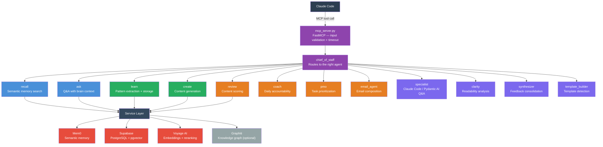
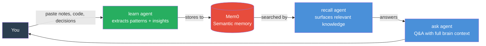
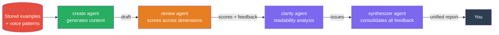
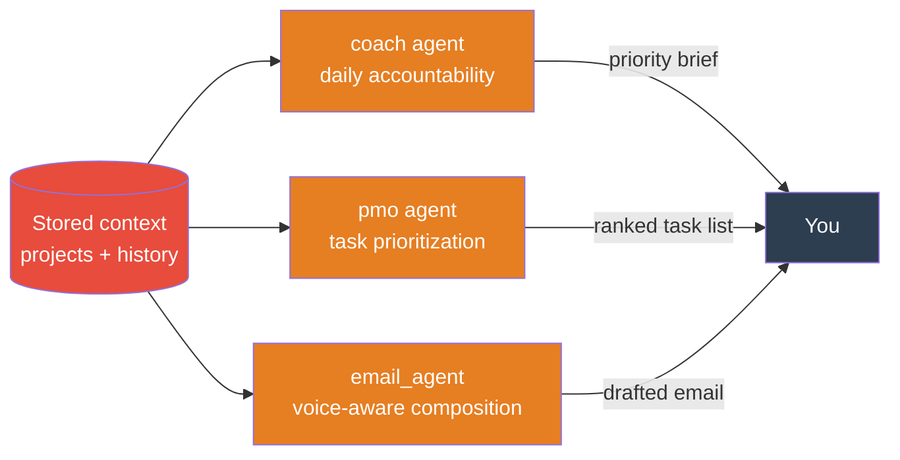
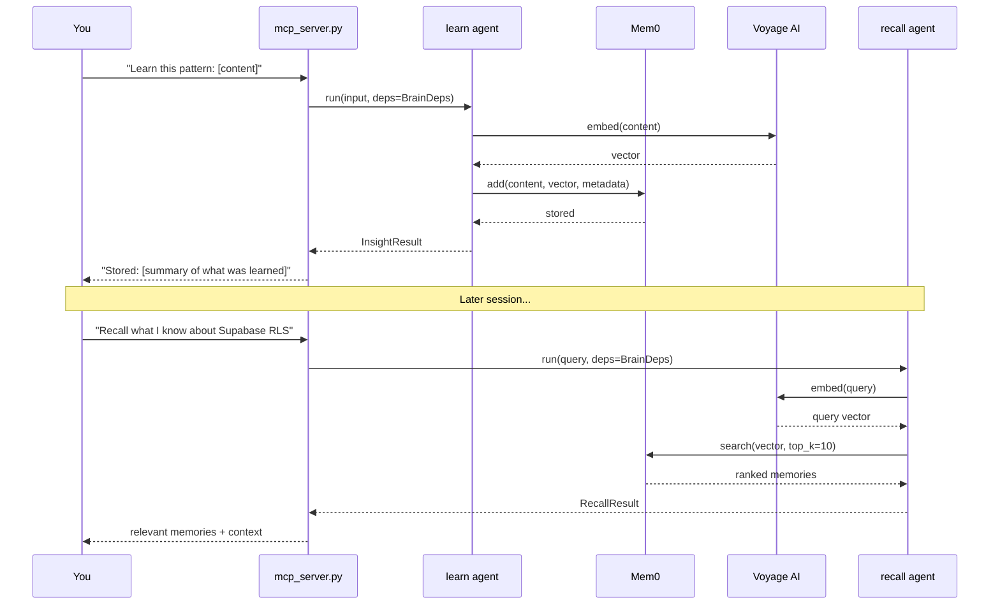
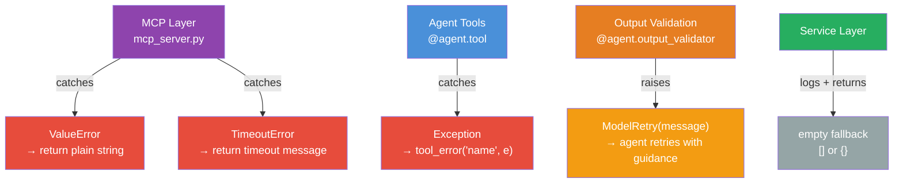

# Second Brain

**A persistent AI memory layer — exposed as an MCP server for Claude Code.**

Your AI forgets everything between sessions. Second Brain fixes that. 13 Pydantic AI agents backed by Mem0 semantic memory, Supabase/pgvector, and Voyage AI embeddings give Claude persistent recall of your decisions, patterns, voice, and priorities. Text, images, PDFs, video — all searchable in one shared vector space.

[](LICENSE)

---

## Why This Exists

Every AI session starts from scratch. You re-explain your architecture, re-describe your preferences, re-establish context — every single time. The Claude that helped you build auth last week has zero memory of it today.

**Second Brain gives Claude a brain that persists.** Store decisions, recall patterns, generate content in your voice, score your work, get coached on priorities. Everything survives across sessions via semantic search — not keyword matching.

---

## Architecture



---

## The 13 Agents

### Memory — Store and retrieve knowledge across sessions



| Agent | What It Does |
|-------|-------------|
| `recall` | Semantic search across stored memory — surfaces past decisions, patterns, and notes by meaning, not keywords |
| `ask` | Answers questions using full brain context — connects stored knowledge to new questions |
| `learn` | Extracts patterns and insights from anything you feed it (notes, code, articles) and stores them |
| `learn_image` | Stores images to Mem0 with multimodal Voyage AI embeddings for cross-modal search |
| `learn_document` | Ingests PDFs, MDX, and TXT documents into semantic memory |
| `learn_video` | Generates multimodal video embeddings via Voyage AI with text context stored to memory |

### Content — Generate and score content in your voice



| Agent | What It Does |
|-------|-------------|
| `create` | Generates content in your authentic voice — pre-loads your voice guide and past examples so drafts match your style from the first attempt |
| `review` | Scores content across multiple dimensions: clarity, structure, impact, tone — returns dimension-by-dimension scores with actionable feedback |
| `clarity` | Readability analysis — flags passive voice, jargon, complex sentences, and structural issues |
| `synthesizer` | Consolidates feedback from multiple sources into a single prioritized action list |
| `template_builder` | Detects when you're repeating a pattern and proposes a reusable template |

### Operations — Manage priorities and communications



| Agent | What It Does |
|-------|-------------|
| `coach` | Daily accountability coaching — surfaces top priorities, checks progress, prompts reflection |
| `pmo` | PMO-style task prioritization — manages competing projects, deadlines, and resource constraints |
| `email_agent` | Composes emails matched to your voice and recipient relationship context |

### Specialist

| Agent | What It Does |
|-------|-------------|
| `specialist` | Deep Q&A on Claude Code, Pydantic AI, and the Second Brain system itself |

---

## Service Layer

Agents never talk to databases directly. Three external systems do the heavy lifting through a clean service abstraction — swappable at runtime via `MEMORY_PROVIDER`.


| Service | Purpose |
|---------|---------|
| `memory.py` | Mem0 wrapper — add, search, and retrieve semantic memories. Retry/timeout hardened via Tenacity (3 attempts, exponential backoff). Supports multimodal content |
| `storage.py` | Supabase wrapper — CRUD for all structured data plus `ContentTypeRegistry` for content type configs |
| `embeddings.py` | Embedding generation via Voyage AI (primary) or OpenAI (fallback). Supports multimodal inputs via `embed_multimodal()` |
| `voyage.py` | Voyage AI reranking + multimodal embeddings — `voyage-multimodal-3.5` embeds text, images, and video into a shared 1024-dim vector space |
| `graphiti.py` | Knowledge graph via Graphiti + FalkorDB — entity and relationship extraction (optional) |
| `graphiti_memory.py` | Adapts Graphiti to the `MemoryServiceBase` interface — complete drop-in replacement for Mem0, all 14 methods implemented |
| `health.py` | Brain metrics, growth milestones, and system health checks |
| `retry.py` | Tenacity retry decorators for transient failures |
| `search_result.py` | Shared data structures for search results across all retrieval methods |
| `abstract.py` | Abstract base classes (`MemoryServiceBase`, etc.) for pluggable service implementations + stub services for testing |

---

## Pluggable Memory Providers

The memory layer is defined by an abstract interface (`MemoryServiceBase`) with three interchangeable backends. Switch between them with a single environment variable:

| Provider | `MEMORY_PROVIDER=` | Backend | Best For |
|----------|-------------------|---------|----------|
| **Mem0** | `mem0` (default) | Mem0 cloud API | Production — managed semantic memory with built-in embedding search |
| **Graphiti** | `graphiti` | FalkorDB graph database | Knowledge graphs — entity/relationship extraction with graph-native search |
| **None** | `none` | In-memory stub | Testing and CI — zero external dependencies, instant startup |

All three providers implement the same 14-method interface. Agents never know which backend is active — they call `memory_service.search()` and get back a `SearchResult` regardless. If a provider fails to initialize, it falls back to Mem0 automatically. Search errors return empty results instead of crashing.

---

## Multi-User Support

Each instance is scoped to a single user via the `BRAIN_USER_ID` environment variable. All reads and writes in `storage.py` are filtered by this value, so multiple instances can share one Supabase deployment without data leaking between users. Existing single-user setups work unchanged — the default value is `ryan`.

---

## Multimodal Support

Store and search across multiple content types — not just text.

| Content Type | MCP Tool | Memory Storage | Vector Embedding |
|-------------|----------|---------------|-----------------|
| **Images** (JPEG, PNG, WebP, GIF) | `learn_image` | Mem0 `image_url` block | Voyage multimodal embedding |
| **Documents** (PDF, MDX, TXT) | `learn_document` | Mem0 `pdf_url` / `mdx_url` block | Text extraction + embedding |
| **Video** | `learn_video` | Text context to Mem0 | Voyage multimodal embedding |
| **Cross-modal search** | `multimodal_vector_search` | — | Combined text + image query vectors |

All multimodal embeddings use `voyage-multimodal-3.5` (1024 dimensions) — the same vector space as text. Images, documents, and video are searchable alongside text memories using the same pgvector infrastructure. No separate migration needed.

The Graphiti memory provider falls back to text-only mode for multimodal content — non-text blocks are skipped with a debug log.

---

## Data Flow

### Learn → Store → Recall



### Error Handling

Three-tier error handling ensures agents never crash — they degrade gracefully:



---

## Tech Stack

| Component | Technology |
|-----------|-----------|
| Language | Python 3.11+ (Docker: 3.12) |
| Agent framework | Pydantic AI (`pydantic-ai[anthropic]`) |
| MCP server | FastMCP |
| Semantic memory | Mem0 (`mem0ai`) |
| Database | Supabase (PostgreSQL + pgvector) |
| Embeddings | Voyage AI `voyage-multimodal-3.5` (primary), OpenAI (text fallback) |
| Image processing | Pillow — decodes base64 images for Voyage multimodal embeddings |
| Knowledge graph | Graphiti + FalkorDB (optional, feature-flagged) |
| LLM providers | Provider registry — Anthropic, OpenAI, Groq, Ollama with fallback chains |
| CLI | Click (`brain` entrypoint) |
| Retries | Tenacity (exponential backoff) |
| Config | Pydantic Settings (`.env` via `BrainConfig`) |
| Testing | pytest + pytest-asyncio (`asyncio_mode = "auto"`) |

---

## Setup

### 1. Python Version

**Requires Python 3.11-3.13.** Python 3.14+ is not supported (`voyageai` requires `<3.14`).

```powershell
# Windows (PowerShell)
py -3.13 -m venv .venv
.venv\Scripts\Activate.ps1

# macOS / Linux
python3.13 -m venv .venv
source .venv/bin/activate
```

### 2. Environment

```bash
cd backend
cp .env.example .env
```

Edit `.env`:

```bash
MEM0_API_KEY=...            # Required — semantic memory store
SUPABASE_URL=...            # Required — structured storage + vector search
SUPABASE_KEY=...            # Required — Supabase service role key
OPENAI_API_KEY=...          # Required — Mem0 internal embeddings (text-embedding-3-small)
VOYAGE_API_KEY=...          # Optional — primary embeddings + reranking (falls back to OpenAI)
MEMORY_PROVIDER=mem0        # mem0 (default), graphiti, or none
BRAIN_USER_ID=ryan          # Optional — isolates data per user (default: ryan)
```

### LLM Backend

Agents use a **provider registry** for flexible LLM selection with automatic fallback chains:

```bash
MODEL_PROVIDER=anthropic         # auto|anthropic|ollama-local|ollama-cloud|openai|groq
MODEL_NAME=claude-sonnet-4-5     # Optional model override
MODEL_FALLBACK_CHAIN=ollama-local  # Optional comma-separated fallback providers
```

`MODEL_PROVIDER=auto` (default) infers from available API keys: Anthropic > Ollama Cloud > Ollama Local. Existing `.env` files with just `ANTHROPIC_API_KEY` work unchanged.

| Provider | `MODEL_PROVIDER=` | Env Vars Required | Default Model |
|----------|-------------------|-------------------|---------------|
| Anthropic | `anthropic` | `ANTHROPIC_API_KEY` | `claude-sonnet-4-5` |
| Ollama Local | `ollama-local` | `OLLAMA_BASE_URL` (optional) | `llama3.1:8b` |
| Ollama Cloud | `ollama-cloud` | `OLLAMA_BASE_URL`, `OLLAMA_API_KEY` | `llama3.1:8b` |
| OpenAI | `openai` | `OPENAI_API_KEY` | `gpt-4o` |
| Groq | `groq` | `GROQ_API_KEY` | `llama-3.3-70b-versatile` |

**Claude Subscription setup** (recommended if you have Claude Pro/Max):

1. Install Claude CLI: `npm install -g @anthropic-ai/claude-code`
2. Authenticate: run `claude` and complete the login flow
3. Set `USE_SUBSCRIPTION=true` in `.env`
4. No `ANTHROPIC_API_KEY` needed — reads your OAuth token from the credential store automatically

The subscription auth works with any MCP client (Claude Code, Cursor, Windsurf, etc.) — the OAuth token is stored on your machine, not tied to the editor.

**Ollama Cloud setup** (for non-Anthropic models):

```bash
MODEL_PROVIDER=ollama-cloud
OLLAMA_BASE_URL=https://your-ollama-endpoint.com
OLLAMA_API_KEY=your-api-key
MODEL_NAME=llama3.1:8b
```

Any OpenAI-compatible API endpoint works here (Ollama, Together AI, OpenRouter, etc.).

### 3. Install

```bash
cd backend
pip install -e ".[dev]"
```

Optional extras:

```bash
pip install -e ".[dev,graphiti]"      # + Graphiti knowledge graph
pip install -e ".[dev,subscription]"  # + Claude Agent SDK (subscription auth)
pip install -e ".[dev,ollama]"        # + Ollama local model support
```

### 4. Database Migrations

Apply migrations in order via the Supabase dashboard or CLI. All 19 migrations are in `backend/supabase/migrations/`, numbered `001` through `019`.

```
001_initial_schema.sql            — Core tables
002_examples_knowledge.sql        — Examples and knowledge tables
003_pattern_constraints.sql       — Pattern uniqueness constraints
004_content_types.sql             — Content type registry
005_growth_tracking_tables.sql    — Growth and milestone tracking
006_rls_policies.sql              — Row Level Security policies
007_foreign_keys_indexes.sql      — Foreign keys and indexes
008_data_constraints.sql          — Data validation constraints
009_reinforce_pattern_rpc.sql     — Pattern reinforcement RPC
010_vector_search_rpc.sql         — pgvector similarity search RPC
011_voyage_dimensions.sql         — Voyage AI embedding dimensions
012_projects_lifecycle.sql        — Project lifecycle tables
013_quality_trending.sql          — Quality score trending
014_content_type_instructions.sql — Content type prompt instructions
015_user_id_isolation.sql         — Multi-user data isolation
016_hnsw_indexes.sql              — HNSW vector indexes for fast similarity search
017_rls_hardening.sql             — Strengthened Row Level Security policies
018_vector_search_hnsw.sql        — Vector search RPC with HNSW ef_search tuning
019_reinforce_pattern_user_id.sql — User-scoped pattern reinforcement
```

### 5. Start the MCP Server

**Local (stdio — default):**

```bash
cd backend
python -m second_brain.mcp_server
```

**Docker (HTTP transport):**

```bash
cd backend
docker compose up -d
```

The container starts with `MCP_TRANSPORT=http` on port 8000, includes a `/health` endpoint, and restarts automatically on failure.

All 13 agents are now available as MCP tools inside Claude Code.

---

## Docker

### Build & Run

```bash
cd backend
docker build -t second-brain-mcp .
docker compose up -d
```

Multi-stage Dockerfile uses uv for fast dependency installation, runs on `python:3.12-slim` as a non-root user, and includes a deep health check that probes `/health` every 30 seconds — returning HTTP 503 when dependency initialization fails.

### Transport Configuration

The server supports three transport modes via the `MCP_TRANSPORT` environment variable:

| Transport | `MCP_TRANSPORT=` | Use Case |
|-----------|-----------------|----------|
| **stdio** | `stdio` (default) | Local development — Claude Code spawns as subprocess |
| **HTTP** | `http` | Docker / network — single `/mcp` endpoint, stateless |
| **Streamable HTTP** | `streamable-http` | Alias for `http` (same behavior in FastMCP 2.x) |
| **SSE** | `sse` | Legacy — Server-Sent Events (deprecated by MCP spec 2025-03-26) |

Additional env vars for HTTP/SSE mode:

```bash
MCP_HOST=0.0.0.0   # Bind address (default: 0.0.0.0)
MCP_PORT=8000       # Port (default: 8000, range: 1024-65535)
```

### Health Check

When running in HTTP/SSE mode, a deep health endpoint is available:

```bash
curl http://localhost:8000/health
# Healthy: {"status": "healthy", "service": "second-brain", "initialized": true}
# Unhealthy (503): {"status": "unhealthy", "service": "second-brain", "error": "..."}
```

Docker's `restart: unless-stopped` policy handles automatic recovery when the health check fails.

---

## MCP Integration

### Local (stdio)

Add to your Claude Code MCP config (`.mcp.json` or `claude_desktop_config.json`):

```json
{
  "mcpServers": {
    "second-brain": {
      "command": "python",
      "args": ["-m", "second_brain.mcp_server"],
      "cwd": "/path/to/repo/backend"
    }
  }
}
```

### Docker (HTTP) — Claude Code

```bash
claude mcp add --transport http second-brain http://localhost:8000/mcp
```

Or add to `.mcp.json`:

```json
{
  "mcpServers": {
    "second-brain": {
      "type": "http",
      "url": "http://localhost:8000/mcp"
    }
  }
}
```

### Docker (HTTP) — Claude Desktop

Claude Desktop requires the `mcp-remote` proxy to connect to HTTP MCP servers:

```json
{
  "mcpServers": {
    "second-brain": {
      "command": "npx",
      "args": ["mcp-remote", "http://localhost:8000/mcp"]
    }
  }
}
```

### Usage Examples

Once connected, call any agent from Claude Code:

```
Use the second brain to recall everything I know about Supabase RLS.

Learn this pattern from my code: [paste code]

Create a LinkedIn post in my voice about shipping this feature.

Review this draft and score it across all dimensions.

Coach me — what should I be focused on today?
```

Manage projects and knowledge directly:

```
List all my active projects.

Update project "auth-system" — mark it as shipped.

Search my stored experiences for anything related to Supabase migrations.

Search patterns — find everything I've learned about rate limiting.

Ingest this example into my brain: [paste code or content]

Add an artifact to project "second-brain" — link to this PR.
```

Multimodal content:

```
Learn this image — it's my app's architecture diagram: [image URL]

Learn this PDF — it's the Supabase RLS guide: [PDF URL]

Learn this video — it's a demo of the new onboarding flow: [video URL]

Search across all my stored content (text + images) for "authentication flow".
```

---

## CLI

Direct access without the MCP layer:

```bash
brain --help         # Show all commands
brain health         # Check brain health and growth milestones
brain migrate        # Run data migration
```

---

## Code Structure

```
backend/
├── src/second_brain/
│   ├── mcp_server.py          # Public surface: @server.tool() functions
│   ├── service_mcp.py         # Supplemental service routing
│   ├── deps.py                # BrainDeps dataclass + create_deps() factory
│   ├── config.py              # BrainConfig (Pydantic Settings, loads .env)
│   ├── schemas.py             # All Pydantic output models (no internal imports)
│   ├── models.py              # AI model selection + provider fallback chains
│   ├── models_sdk.py          # Claude SDK model support (subscription auth)
│   ├── auth.py                # Authentication helpers
│   ├── migrate.py             # Data migration utilities
│   ├── cli.py                 # Click CLI ("brain" command)
│   ├── providers/
│   │   ├── __init__.py        # BaseProvider ABC + provider registry
│   │   ├── anthropic.py       # Anthropic Claude (API key + subscription)
│   │   ├── ollama.py          # Ollama local + cloud providers
│   │   ├── openai.py          # OpenAI GPT provider
│   │   └── groq.py            # Groq fast inference provider
│   ├── agents/
│   │   ├── chief_of_staff.py  # Routing orchestrator
│   │   ├── recall.py          # Semantic memory search
│   │   ├── ask.py             # Q&A with brain context
│   │   ├── learn.py           # Pattern extraction + storage
│   │   ├── create.py          # Content generation (voice-aware)
│   │   ├── review.py          # Multi-dimension content scoring
│   │   ├── coach.py           # Daily accountability coaching
│   │   ├── pmo.py             # Task prioritization
│   │   ├── email_agent.py     # Email composition
│   │   ├── specialist.py      # Claude Code / Pydantic AI Q&A
│   │   ├── clarity.py         # Readability analysis
│   │   ├── synthesizer.py     # Feedback consolidation
│   │   ├── template_builder.py# Template opportunity detection
│   │   └── utils.py           # Shared: tool_error(), run_pipeline(), format_*()
│   └── services/
│       ├── memory.py          # Mem0 semantic memory wrapper
│       ├── storage.py         # Supabase CRUD + ContentTypeRegistry
│       ├── embeddings.py      # Voyage AI / OpenAI embedding generation
│       ├── voyage.py          # Voyage AI reranking
│       ├── graphiti.py        # Knowledge graph (optional)
│       ├── graphiti_memory.py # Graphiti-backed MemoryServiceBase adapter
│       ├── health.py          # Brain metrics + growth milestones
│       ├── retry.py           # Tenacity retry helpers
│       ├── search_result.py   # Search result data structures
│       └── abstract.py        # ABCs + stub services (MemoryServiceBase, etc.)
├── supabase/migrations/       # 19 SQL migrations (001–019)
├── tests/                     # 1060+ tests across 24 files
├── docs/                      # Operational runbooks and integration guides
├── scripts/                   # Utility scripts
├── Dockerfile                 # Multi-stage uv build (Python 3.12)
├── docker-compose.yml         # Docker compose (HTTP transport)
├── .env.example               # Documented env var template
├── uv.lock                    # Lockfile for reproducible Docker builds
└── pyproject.toml             # Dependencies + pytest config
```

---

## Tests

```bash
cd backend
pytest                              # All tests (1060+)
pytest tests/test_agents.py         # Single file
pytest -k "test_recall"             # Filter by name
pytest -x                           # Stop on first failure
pytest -v                           # Verbose output
```

One test file per source module. All async tests run without `@pytest.mark.asyncio` — `asyncio_mode = "auto"` in `pyproject.toml`.

---

## By the Numbers

| Component | Count |
|-----------|-------|
| Pydantic AI agents | 13 |
| MCP tools | 42 |
| Service modules | 11 |
| LLM providers | 5 |
| Database migrations | 19 |
| Test files | 24 |
| Tests | 1060+ |
| Python version | 3.11+ |

---

## License

[MIT](LICENSE)
