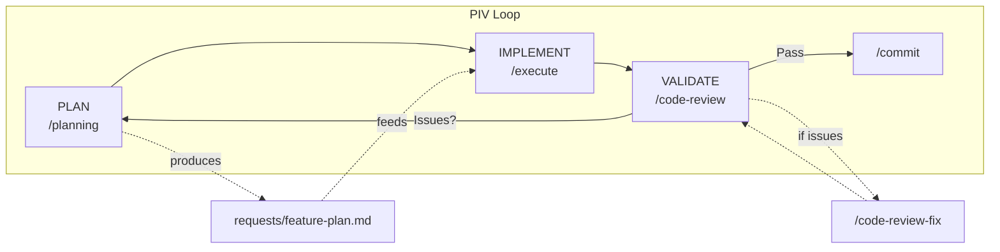
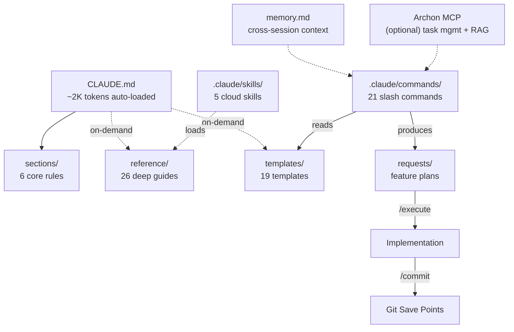

# My Coding System

A comprehensive AI-assisted development methodology combining systematic planning, implementation discipline, and validation strategies.

Built for [Claude Code](https://claude.com/claude-code) | Powered by the PIV Loop | [MIT License](LICENSE)

---

## What is this?

This is NOT an application — it's a **development methodology** for building applications with AI assistance. It provides structured workflows (slash commands), context management (auto-loaded rules + on-demand guides), and quality gates (code review, validation) that turn AI from a "guess and check" tool into a reliable development partner.

The core idea: give the AI exactly the right context at the right time, and it produces dramatically better output. Too little context and it guesses. Too much context and it drowns. This system manages that balance automatically.

---

## The PIV Loop

The PIV Loop is the core workflow: **Plan**, **Implement**, **Validate**, then iterate.



- **Plan**: Vibe planning conversation into a structured plan document (500-700 lines of context-rich implementation instructions)
- **Implement**: Execute the plan task-by-task in a fresh conversation (clean context = better output)
- **Validate**: Code review, testing, and human review. Issues loop back to Plan.

---

## System Architecture

Context is organized in layers — auto-loaded context stays minimal so the AI has maximum context window for actual work. Deep guides load on-demand only when relevant.



---

## Quick Start

### Prerequisites
- [Claude Code CLI](https://claude.com/claude-code) installed
- Git configured

### Setup

1. **Clone** this repo into your project (or fork it):
   ```bash
   git clone https://github.com/ryanjosebrosas/my-coding-system-claude.git
   cd my-coding-system
   ```

2. **Create your memory file** from the template:
   ```bash
   cp templates/MEMORY-TEMPLATE.md memory.md
   ```

3. **Start a Claude Code session** and prime the system:
   ```bash
   claude
   > /prime
   ```

4. **Plan your first feature**:
   ```
   > /planning user-authentication
   ```

5. **Execute the plan** (in a fresh session for clean context):
   ```
   > /execute requests/user-authentication-plan.md
   ```

6. **Commit your work**:
   ```
   > /commit
   ```

### First Time?
Start with `/prime` to understand the system, then try `/planning` on a small feature. Read `reference/file-structure.md` for a full map of everything included.

---

## Adopting for Your Project

There are two ways to use this system:

### Option A: Use as Your Project Base (Recommended for new projects)
Fork or clone this repo, then build your application inside it. The slash commands, templates, and reference guides are all ready to go.

### Option B: Copy Into an Existing Project
Copy these directories into your project root:
```bash
cp -r sections/ reference/ templates/ requests/ your-project/
cp CLAUDE.md AGENTS.md .coderabbit.yaml your-project/
cp -r .claude/ your-project/
cp templates/MEMORY-TEMPLATE.md your-project/memory.md
```

Then update `CLAUDE.md` for your project's specifics using `/init-c`.

### After Setup
- `memory.md` — Created from template, gitignored. Each developer maintains their own.
- `requests/*.md` — Feature plans, gitignored. Project-specific and ephemeral.
- `.claude/settings.local.json` — Personal Claude Code settings, gitignored.

---

## Model Strategy

The system separates planning from execution across different model tiers:

| Phase | Recommended Model | Why |
|-------|-------------------|-----|
| `/planning` | **Opus** (`claude --model opus`) | Deep reasoning produces better plans |
| `/execute` | **Sonnet** (`claude` default) | Balanced — follows plans well at lower cost |
| `/code-review` | **Haiku** (via subagents) | Pattern matching at 1/10th the cost |
| `/commit`, `/prime` | **Sonnet** (`claude` default) | General-purpose tasks |

```bash
# Planning session (Opus for deep reasoning)
claude --model opus
> /planning my-feature

# Execution session (Sonnet for focused implementation)
claude
> /execute requests/my-feature-plan.md
```

See `reference/multi-model-strategy.md` for the full cost optimization guide.

---

## Core Commands

### Essential Workflow

| Command | Description | When to Use |
|---------|-------------|-------------|
| `/prime` | Load codebase context | Start of every session |
| `/planning [feature]` | Create implementation plan | Before building any feature |
| `/execute [plan]` | Implement from plan file | After planning |
| `/commit` | Git commit with conventional format | After implementation |
| `/code-review` | Technical quality review | After implementation |
| `/code-review-fix` | Fix review findings | After code review |

### Advanced Workflows

| Command | Description | When to Use |
|---------|-------------|-------------|
| `/end-to-end-feature` | Full autonomous pipeline | Trusted, simple features |
| `/team [plan]` | Multi-agent coordinated build | Complex features needing coordination |
| `/new-worktree` | Create parallel branch | Multi-feature work |
| `/merge-worktrees` | Merge worktree branches | After parallel implementation |
| `/parallel-e2e` | Parallel multi-feature | Advanced parallel builds |

### Utilities

| Command | Description | When to Use |
|---------|-------------|-------------|
| `/rca [issue]` | Root cause analysis | GitHub issue investigation |
| `/implement-fix` | Implement fix from RCA | After root cause analysis |
| `/create-prd` | Generate PRD from conversation | Defining a new product |
| `/create-pr` | Create GitHub PR | After pushing a branch |
| `/execution-report` | Generate implementation report | Post-implementation review |
| `/init-c` | Generate CLAUDE.md for new project | New projects |
| `/agents` | Create custom subagent definitions | Extending the system |
| `/system-review` | Divergence analysis | Auditing system state |

---

## Agent Teams

For complex features, Agent Teams coordinates multiple Claude instances with contract-first spawning — upstream agents publish interfaces before downstream agents start building.

```bash
# Plan the feature (Opus recommended for deep reasoning)
claude --model opus
> /planning my-feature

# Execute with a coordinated team (Sonnet recommended for speed)
> /team requests/my-feature-plan.md
```

See `reference/agent-teams-overview.md` for the full architecture guide.

---

## Subagents

12 agents are pre-installed in `.claude/agents/` across 4 categories:

| Agent | Model | Purpose |
|-------|-------|---------|
| research-codebase | Haiku | Parallel codebase exploration |
| research-external | Sonnet | Documentation and best practices |
| code-review-type-safety | Haiku | Type annotation review |
| code-review-security | Haiku | Security vulnerability review |
| code-review-architecture | Haiku | Design pattern compliance |
| code-review-performance | Haiku | Performance issue detection |
| plan-validator | Haiku | Plan structure validation |
| test-generator | Haiku | Test case suggestions |
| specialist-devops | Sonnet | CI/CD, Docker, IaC, deployments |
| specialist-data | Sonnet | DB design, migrations, queries |
| specialist-copywriter | Sonnet | UI copy, error messages, UX writing |
| specialist-tech-writer | Sonnet | API docs, READMEs, changelogs |

See `reference/subagents-overview.md` for creating your own agents.

---

## GitHub Actions

The system includes workflows for AI-assisted issue resolution:

- **`.github/workflows/claude-fix.yml`** — Triggers when you comment `@claude-fix` on an issue or PR
- **`reference/github-workflows/claude-fix-coderabbit.yml`** — Auto-fixes CodeRabbit review suggestions

### Setup

1. Add `CLAUDE_CODE_OAUTH_TOKEN` to your repo secrets (Settings > Secrets and variables > Actions)
2. Add `AUTHORIZED_USERS` as a repository variable with a JSON array of allowed GitHub usernames:
   ```
   ["your-username", "teammate"]
   ```
   (Settings > Secrets and variables > Actions > Variables)
3. Copy workflows to your project's `.github/workflows/` directory

See `reference/github-integration.md` for the full setup guide.

---

## Optional: Archon MCP

The system architecture diagram shows [Archon MCP](https://github.com/coleam00/archon) for task management and RAG search. This is **optional** — all commands work without it. If configured, Archon provides:

- Task tracking across planning and execution sessions
- RAG search over curated documentation

See `reference/archon-workflow.md` for setup instructions.

---

## Project Structure

```
My-Coding-System/
├── CLAUDE.md              # Auto-loaded rules (slim, ~2K tokens)
├── AGENTS.md              # Agent guidance for AI assistants
├── LICENSE                # MIT License
├── .gitignore             # Protects secrets, memory, plans
├── memory.md              # Cross-session memory (create from template)
├── sections/              # Core rule sections (6 files, auto-loaded)
├── reference/             # Deep guides (26 guides, on-demand)
├── templates/             # Reusable templates (19 files)
├── requests/              # Feature plans (gitignored, per PIV loop)
├── .claude/commands/      # Slash commands (21 commands)
├── .claude/skills/        # Cloud skills (5 skills)
├── .claude/agents/        # Custom subagents (12 agents, pre-installed)
└── .github/workflows/     # GitHub Action workflows
```

---

## Core Principles

- **YAGNI** — Only implement what's needed right now
- **KISS** — Prefer simple, readable solutions over clever abstractions
- **DRY** — Extract common patterns, but don't over-abstract
- **Limit AI Assumptions** — Be explicit in plans and prompts
- **Always Be Priming (ABP)** — Start every session with `/prime`. Context is everything.

---

## On-Demand Guides

| Guide | Load when... |
|-------|-------------|
| `reference/layer1-guide.md` | Setting up CLAUDE.md for a new project |
| `reference/system-foundations.md` | Learning system mental models |
| `reference/piv-loop-practice.md` | PIV Loop practical application |
| `reference/planning-methodology-guide.md` | 6-phase planning methodology |
| `reference/validation-strategy.md` | Planning or running validation |
| `reference/validation-discipline.md` | 5-level validation pyramid |
| `reference/file-structure.md` | Looking up where files belong |
| `reference/command-design-overview.md` | Designing or modifying slash commands |
| `reference/github-integration.md` | Setting up GitHub Actions or CodeRabbit |
| `reference/remote-system-overview.md` | Deploying or using the remote coding agent |
| `reference/mcp-skills-overview.md` | Configuring MCP servers or creating skills |
| `reference/subagents-overview.md` | Creating or debugging subagents |
| `reference/archon-workflow.md` | Using Archon task management or RAG search |
| `reference/git-worktrees-overview.md` | Parallel feature implementation with worktrees |
| `reference/agent-teams-overview.md` | Agent Teams architecture and `/team` command |
| `reference/multi-model-strategy.md` | Model selection and cost optimization |

---

## Recent Changes: System Integrity Audit

A 4-phase system integrity audit was completed to fix structural inconsistencies, dead references, and documentation gaps across the entire system. All changes are tracked in `requests/system-integrity-audit-plan-*.md`.

**Phase 1 — Critical Fixes**: Removed dead `_examples/` references from agents and commands, fixed broken cross-references in `file-structure.md` and auto-memory, corrected the agents directory listing.

**Phase 2 — Structural Alignment**: Renumbered `sections/15_archon_workflow.md` to `sections/06_archon_workflow.md` for continuous numbering (01-06), updated all cross-references, expanded the CLAUDE.md on-demand guide table from 11 to 15 entries, and added the `/init-c` alignment note clarifying methodology sections (01-06) vs application sections (01-10).

**Phase 3 — Template & Agent Fixes**: Linked 3 orphaned templates (`SKILL-TEMPLATE`, `BASELINE-ASSESSMENT-TEMPLATE`, `META-REASONING-CHECKLIST`) from their relevant reference guides, added acceptance criteria to `SUB-PLAN-TEMPLATE`, created bidirectional links between `VALIDATION-PROMPT` and `VALIDATION-REPORT-TEMPLATE`, replaced hard-coded line numbers in the agents README with section references, and added tool access and cost context notes.

**Phase 4 — Documentation Polish**: Operationalized the 4 Context Engineering pillars with a concrete pillar-to-plan-section mapping table, reconciled Archon language to conditional ("when available") throughout, added the 5-level validation pyramid reference to the PIV Loop section, clarified `memory.md` update timing to include mid-planning decisions, and linked section 02 back to section 03 for pillar details.

---

## Token Budget

The system manages tokens carefully to maximize context window for actual work:

- **Auto-loaded**: ~2K tokens (CLAUDE.md + 6 sections)
- **Commands**: loaded only when invoked (largest: `/planning` ~2.2K tokens)
- **Reference guides**: loaded only when needed (26 guides available on-demand)
- **Typical session**: uses <10K tokens of system context, leaving the rest for implementation

---

## License

This project is licensed under the [MIT License](LICENSE).
