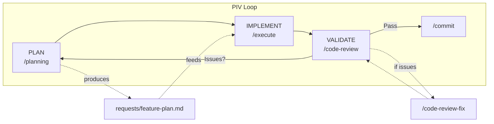
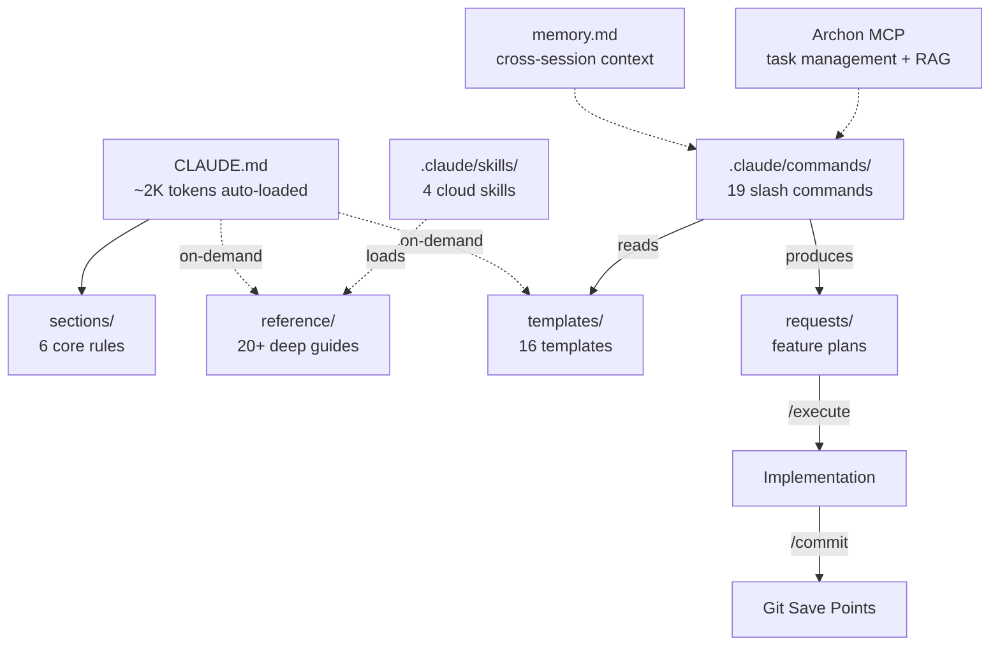

# My Coding System

A comprehensive AI-assisted development methodology combining systematic planning, implementation discipline, and validation strategies.

Built for [Claude Code](https://claude.com/claude-code) | Powered by the PIV Loop

---

## What is this?

This is NOT an application — it's a **development methodology** for building applications with AI assistance. It provides structured workflows (slash commands), context management (auto-loaded rules + on-demand guides), and quality gates (code review, validation) that turn AI from a "guess and check" tool into a reliable development partner.

The core idea: give the AI exactly the right context at the right time, and it produces dramatically better output. Too little context and it guesses. Too much context and it drowns. This system manages that balance automatically.

---

## The PIV Loop

The PIV Loop is the core workflow: **Plan**, **Implement**, **Validate**, then iterate.



- **Plan**: Vibe planning conversation into a structured plan document (500-700 lines of context-rich implementation instructions)
- **Implement**: Execute the plan task-by-task in a fresh conversation (clean context = better output)
- **Validate**: Code review, testing, and human review. Issues loop back to Plan.

---

## System Architecture

Context is organized in layers — auto-loaded context stays minimal so the AI has maximum context window for actual work. Deep guides load on-demand only when relevant.



Auto-loaded context is kept minimal (~2K tokens) so the AI has maximum context window available for actual work. Deep guides are loaded on-demand only when relevant.

---

## Quick Start

### Prerequisites
- [Claude Code CLI](https://claude.com/claude-code) installed
- Git configured

### Setup
1. Clone this repo (or copy to your project)
2. Run `/prime` to load codebase context
3. Run `/planning [feature description]` to create a plan
4. Run `/execute requests/feature-plan.md` to implement
5. Run `/commit` to save your work

### First Time?
Start with `/prime` to understand the system, then try `/planning` on a small feature.

---

## Core Commands

| Command | Description | When to Use |
|---------|-------------|-------------|
| `/prime` | Load codebase context | Start of every session |
| `/planning [feature]` | Create implementation plan | Before building any feature |
| `/execute [plan]` | Implement from plan file | After planning |
| `/commit` | Git commit with conventional format | After implementation |
| `/code-review` | Technical quality review | After implementation |
| `/code-review-fix` | Fix review findings | After code review |
| `/end-to-end-feature` | Full autonomous pipeline | Trusted, simple features |
| `/new-worktree` | Create parallel branch | Multi-feature work |
| `/parallel-e2e` | Parallel multi-feature | Advanced parallel builds |
| `/init-c` | Generate CLAUDE.md for new project | New projects |

---

## Project Structure

```
My-Coding-System/
├── CLAUDE.md              # Auto-loaded rules (slim, ~2K tokens)
├── memory.md              # Cross-session memory
├── sections/              # Core rule sections (auto-loaded)
├── reference/             # Deep guides (on-demand, ~89K tokens)
├── templates/             # Reusable templates (16 files)
├── requests/              # Feature plans (per PIV loop)
├── .claude/commands/      # Slash commands (19 commands)
├── .claude/skills/        # Cloud skills (4 skills)
└── .claude/agents/        # Subagent examples (6 agents)
```

---

## Core Principles

- **YAGNI** — Only implement what's needed right now
- **KISS** — Prefer simple, readable solutions over clever abstractions
- **DRY** — Extract common patterns, but don't over-abstract
- **Limit AI Assumptions** — Be explicit in plans and prompts
- **Always Be Priming (ABP)** — Start every session with `/prime`. Context is everything.

---

## On-Demand Guides

| Guide | Load when... |
|-------|-------------|
| `reference/layer1-guide.md` | Setting up CLAUDE.md for a new project |
| `reference/validation-strategy.md` | Planning or running validation |
| `reference/file-structure.md` | Looking up where files belong |
| `reference/command-design-overview.md` | Designing or modifying slash commands |
| `reference/github-integration.md` | Setting up GitHub Actions or CodeRabbit |
| `reference/remote-system-overview.md` | Deploying or using the remote coding agent |
| `reference/mcp-skills-overview.md` | Configuring MCP servers or creating skills |
| `reference/subagents-overview.md` | Creating or debugging subagents |
| `reference/archon-workflow.md` | Using Archon task management or RAG search |
| `reference/git-worktrees-overview.md` | Parallel feature implementation with worktrees |

---

## Token Budget

The system manages tokens carefully to maximize context window for actual work:

- **Auto-loaded**: ~2K tokens (CLAUDE.md + 6 sections)
- **Commands**: loaded only when invoked (largest: `/planning` ~2.2K tokens)
- **Reference guides**: loaded only when needed (~89K tokens available)
- **Typical session**: uses <10K tokens of system context, leaving the rest for implementation
