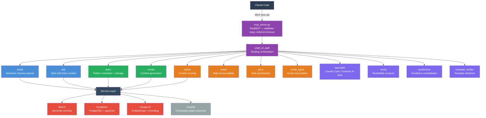
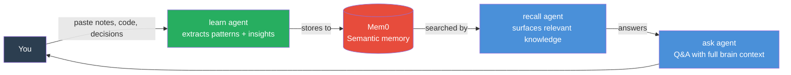
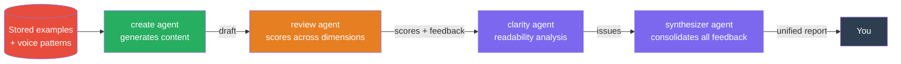
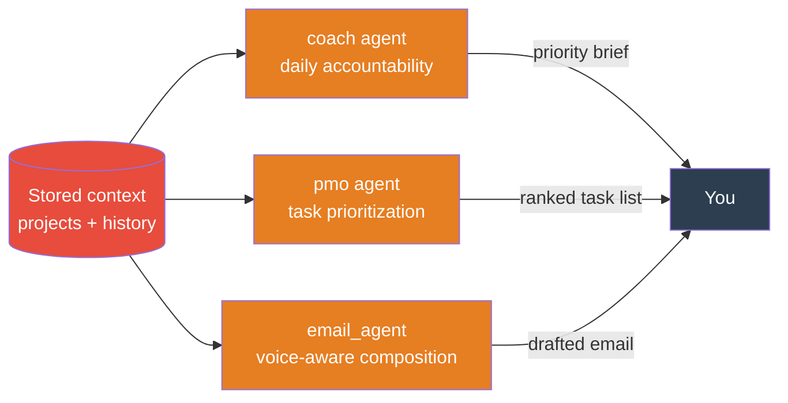
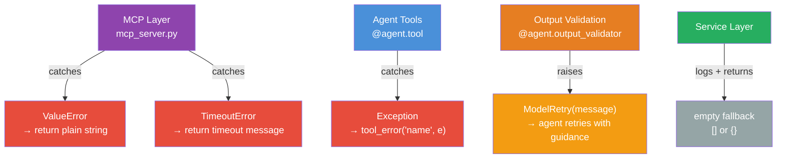

# Second Brain

**A personal AI memory and knowledge system — exposed as an MCP server for Claude Code.**

13 Pydantic AI agents backed by Mem0 semantic memory, Supabase/pgvector, and Voyage AI multimodal embeddings. Your AI remembers what you've built, what you've learned, and how you think — across every session. Supports text, images, PDFs, and video.

[](LICENSE)

---

## The Problem

Most AI sessions start from zero. You re-explain your architecture, re-describe your voice, re-establish your preferences — every time. The AI that helped you build your auth system last week has no idea it exists today.

**Second Brain fixes that.** It gives Claude Code a persistent memory layer: store decisions, recall patterns, generate content in your voice, score your work, and get coaching on your priorities. Everything persists across sessions via semantic search, not keyword matching.

---

## How It Works



---

## The 13 Agents

### Memory Agents — Store and retrieve knowledge across sessions



| Agent | What It Does |
|-------|-------------|
| `recall` | Semantic search across everything stored in memory — surfaces relevant past decisions, patterns, and notes |
| `ask` | Answers questions using full brain context — connects your stored knowledge to new questions |
| `learn` | Extracts patterns and insights from anything you feed it (notes, code, articles) and stores them |
| `learn_image` | Stores images to Mem0 + generates multimodal Voyage AI embeddings for cross-modal search |
| `learn_document` | Ingests PDFs, MDX, and TXT documents into semantic memory |
| `learn_video` | Generates multimodal video embeddings via Voyage AI with text context stored to memory |

### Content Agents — Generate and score content in your voice



| Agent | What It Does |
|-------|-------------|
| `create` | Generates content (posts, docs, emails, code comments) with awareness of your stored voice and style examples |
| `review` | Scores content across multiple dimensions: clarity, structure, impact, tone — returns dimension-by-dimension scores |
| `clarity` | Readability analysis — identifies passive voice, jargon, complex sentences, and structural issues |
| `synthesizer` | Consolidates feedback from multiple sources (review scores, clarity issues, your notes) into a single prioritized action list |
| `template_builder` | Detects when you're repeating a pattern and proposes a reusable template |

### Operations Agents — Manage priorities and communications



| Agent | What It Does |
|-------|-------------|
| `coach` | Daily accountability coaching — surfaces your top priorities, checks progress against goals, prompts reflection |
| `pmo` | PMO-style task prioritization — manages competing projects, deadlines, and resource constraints |
| `email_agent` | Composes emails matched to your voice and the relationship context of the recipient |

### Specialist Agent

| Agent | What It Does |
|-------|-------------|
| `specialist` | Deep Q&A on Claude Code, Pydantic AI, and the Second Brain system itself — uses stored knowledge of your setup |

---

## Service Layer

Three external systems do the actual work. Agents call them through a clean service abstraction — swappable at runtime via `MEMORY_PROVIDER` (mem0, graphiti, or none).


| Service | Purpose |
|---------|---------|
| `memory.py` | Wraps Mem0 — add, search, and retrieve semantic memories with embedding-based similarity. Supports multimodal content (images, PDFs, documents) |
| `storage.py` | Wraps Supabase — CRUD for all structured data + `ContentTypeRegistry` for content type configs |
| `embeddings.py` | Generates embeddings via Voyage AI (primary) or OpenAI (fallback) for vector search. Supports multimodal inputs (text + images) via `embed_multimodal()` |
| `voyage.py` | Voyage AI reranking + multimodal embeddings — `voyage-multimodal-3.5` embeds text, images, and video into a shared 1024-dim vector space |
| `graphiti.py` | Optional knowledge graph via Graphiti + FalkorDB — entity and relationship extraction |
| `graphiti_memory.py` | Adapts Graphiti to the `MemoryServiceBase` interface — drop-in replacement for Mem0 |
| `health.py` | Brain metrics, growth milestones, and system health checks |
| `retry.py` | Tenacity retry decorators for transient failures |
| `search_result.py` | Shared data structures for search results across all retrieval methods |
| `abstract.py` | Abstract base classes (`MemoryServiceBase`, etc.) for pluggable service implementations + stub services for testing |

---

## Multi-User Support

Each Second Brain instance is scoped to a single user via the `BRAIN_USER_ID` environment variable. All reads and writes in `storage.py` are filtered by this value, so multiple instances can share one Supabase deployment without data leaking between users. Migration `015_user_id_isolation.sql` adds a `user_id` column and performance index to every relevant table, and updates the `vector_search` RPC to enforce the same boundary. Existing single-user setups work unchanged — the default value is `ryan`, so no configuration change is required unless you are adding a second user.

---

## Pluggable Memory Providers

The memory layer is defined by an abstract interface (`MemoryServiceBase`) with three interchangeable backends — switch between them with a single environment variable:

| Provider | `MEMORY_PROVIDER=` | Backend | Best For |
|----------|-------------------|---------|----------|
| **Mem0** | `mem0` (default) | Mem0 cloud API | Production — managed semantic memory with built-in embedding search |
| **Graphiti** | `graphiti` | FalkorDB graph database | Knowledge graphs — entity/relationship extraction with graph-native search |
| **None** | `none` | In-memory stub | Testing and CI — zero external dependencies, instant startup |

All three providers implement the same 13-method interface. Agents never know which backend is active — they call `memory_service.search()` and get back a `SearchResult` regardless. If a provider fails to initialize (e.g., Graphiti packages not installed), it falls back to Mem0 automatically. Search errors return empty results instead of crashing.

---

## Multimodal Support

Second Brain supports storing and searching across multiple content types — not just text.

| Content Type | MCP Tool | Memory Storage | Vector Embedding |
|-------------|----------|---------------|-----------------|
| **Images** (JPEG, PNG, WebP, GIF) | `learn_image` | Mem0 `image_url` block | Voyage multimodal embedding |
| **Documents** (PDF, MDX, TXT) | `learn_document` | Mem0 `pdf_url` / `mdx_url` block | Text extraction + embedding |
| **Video** | `learn_video` | Text context to Mem0 | Voyage multimodal embedding |
| **Cross-modal search** | `multimodal_vector_search` | — | Combined text + image query vectors |

All multimodal embeddings use `voyage-multimodal-3.5` (1024 dimensions) — the same vector space as text embeddings. This means images, documents, and video are searchable alongside text memories using the same pgvector infrastructure. No database migration needed.

The Graphiti memory provider falls back to text-only mode for multimodal content — non-text blocks are skipped with a debug log.

---

## Data Flow

### Learn → Store → Recall


### Error Handling



---

## Tech Stack

| Component | Technology |
|-----------|-----------|
| Language | Python 3.11+ |
| Agent framework | Pydantic AI (`pydantic-ai[anthropic]`) |
| MCP server | FastMCP |
| Semantic memory | Mem0 (`mem0ai`) |
| Database | Supabase (PostgreSQL + pgvector) |
| Embeddings | Voyage AI `voyage-multimodal-3.5` (primary, text + images + video), OpenAI (text fallback) |
| Image processing | Pillow (PIL) — decodes base64 images for Voyage multimodal embeddings |
| Knowledge graph | Graphiti + FalkorDB (optional, `GRAPHITI_ENABLED=false`) |
| CLI | Click (`brain` entrypoint) |
| Retries | Tenacity |
| Config | Pydantic Settings (loads `.env` via `BrainConfig`) |
| Testing | pytest + pytest-asyncio (`asyncio_mode = "auto"`) |

---

## Setup

### 1. Environment

```bash
cd backend
cp .env.example .env
```

Edit `.env`:

```bash
ANTHROPIC_API_KEY=...       # Required — powers all agents
MEM0_API_KEY=...            # Required — semantic memory store
SUPABASE_URL=...            # Required — structured storage + vector search
SUPABASE_KEY=...            # Required — Supabase service role key
VOYAGE_API_KEY=...          # Optional — falls back to OpenAI embeddings
GRAPHITI_ENABLED=false      # Set true to enable knowledge graph (needs FalkorDB)
MEMORY_PROVIDER=mem0        # mem0 (default), graphiti, or none (stub for testing)
BRAIN_USER_ID=ryan          # Optional — isolates data per user (default: ryan)
```

### 2. Install

```bash
cd backend
pip install -e ".[dev]"
```

Optional extras:

```bash
pip install -e ".[dev,graphiti]"      # + Graphiti knowledge graph
pip install -e ".[dev,subscription]"  # + Claude Agent SDK (subscription auth)
pip install -e ".[dev,ollama]"        # + Ollama local model support
```

### 3. Database Migrations

Apply migrations in order via the Supabase dashboard or CLI. All 15 migrations are in `backend/supabase/migrations/`, numbered `001` through `015`.

```
001_initial_schema.sql            — Core tables
002_examples_knowledge.sql        — Examples and knowledge tables
003_pattern_constraints.sql       — Pattern uniqueness constraints
004_content_types.sql             — Content type registry
005_growth_tracking_tables.sql    — Growth and milestone tracking
006_rls_policies.sql              — Row Level Security policies
007_foreign_keys_indexes.sql      — Foreign keys and indexes
008_data_constraints.sql          — Data validation constraints
009_reinforce_pattern_rpc.sql     — Pattern reinforcement RPC
010_vector_search_rpc.sql         — pgvector similarity search RPC
011_voyage_dimensions.sql         — Voyage AI embedding dimensions
012_projects_lifecycle.sql        — Project lifecycle tables
013_quality_trending.sql          — Quality score trending
014_content_type_instructions.sql — Content type prompt instructions
015_user_id_isolation.sql         — Multi-user data isolation (user_id column + indexes)
```

### 4. Start the MCP Server

**Local (stdio — default):**

```bash
cd backend
python -m second_brain.mcp_server
```

**Docker (HTTP transport):**

```bash
cd backend
docker compose up -d
```

The container starts with `MCP_TRANSPORT=http` on port 8000, includes a `/health` endpoint, and restarts automatically on failure.

All 13 agents are now available as MCP tools inside Claude Code.

---

## Docker

### Build & Run

```bash
cd backend
docker build -t second-brain-mcp .
docker compose up -d
```

The multi-stage Dockerfile uses `python:3.11-slim`, runs as a non-root user, and includes a health check that probes `/health` every 30 seconds.

### Transport Configuration

The server supports three transport modes, configured via the `MCP_TRANSPORT` environment variable:

| Transport | `MCP_TRANSPORT=` | Use Case |
|-----------|-----------------|----------|
| **stdio** | `stdio` (default) | Local development — Claude Code spawns as subprocess |
| **HTTP** | `http` | Docker / network — single `/mcp` endpoint, stateless |
| **SSE** | `sse` | Legacy — Server-Sent Events (deprecated by MCP spec) |

Additional env vars for HTTP/SSE mode:

```bash
MCP_HOST=0.0.0.0   # Bind address (default: 0.0.0.0)
MCP_PORT=8000       # Port (default: 8000, range: 1024-65535)
```

### Health Check

When running in HTTP/SSE mode, a health endpoint is available:

```bash
curl http://localhost:8000/health
# {"status": "healthy", "service": "second-brain"}
```

---

## MCP Integration

### Local (stdio)

Add to your Claude Code MCP config (`.mcp.json` or `claude_desktop_config.json`):

```json
{
  "mcpServers": {
    "second-brain": {
      "command": "python",
      "args": ["-m", "second_brain.mcp_server"],
      "cwd": "/path/to/repo/backend"
    }
  }
}
```

### Docker (HTTP) — Claude Code

```bash
claude mcp add --transport http second-brain http://localhost:8000/mcp
```

Or add to `.mcp.json`:

```json
{
  "mcpServers": {
    "second-brain": {
      "type": "http",
      "url": "http://localhost:8000/mcp"
    }
  }
}
```

### Docker (HTTP) — Claude Desktop

Claude Desktop requires the `mcp-remote` proxy to connect to HTTP MCP servers:

```json
{
  "mcpServers": {
    "second-brain": {
      "command": "npx",
      "args": ["mcp-remote", "http://localhost:8000/mcp"]
    }
  }
}
```

Once connected, you can call any agent from Claude Code:

```
Use the second brain to recall everything I know about Supabase RLS.

Learn this pattern from my code: [paste code]

Create a LinkedIn post in my voice about shipping this feature.

Review this draft and score it across all dimensions.

Coach me — what should I be focused on today?
```

You can also manage projects and knowledge directly:

```
List all my active projects.

Update project "auth-system" — mark it as shipped.

Search my stored experiences for anything related to Supabase migrations.

Search patterns — find everything I've learned about rate limiting.

Ingest this example into my brain: [paste code or content]

Add an artifact to project "second-brain" — link to this PR.

Ingest this knowledge entry: [paste article, doc, or note]
```

### Multimodal Content

Store images, documents, and video alongside text memories:

```
Learn this image — it's my app's architecture diagram: [image URL]

Learn this PDF — it's the Supabase RLS guide: [PDF URL]

Learn this video — it's a demo of the new onboarding flow: [video URL]

Search across all my stored content (text + images) for "authentication flow".
```

---

## CLI

Direct access without the MCP layer:

```bash
brain --help         # Show all commands
brain health         # Check brain health and growth milestones
brain migrate        # Run data migration
```

---

## Code Structure

```
backend/
├── src/second_brain/
│   ├── mcp_server.py          # Public surface: @server.tool() functions
│   ├── service_mcp.py         # Supplemental service routing
│   ├── deps.py                # BrainDeps dataclass + create_deps() factory
│   ├── config.py              # BrainConfig (Pydantic Settings, loads .env)
│   ├── schemas.py             # All Pydantic output models (no internal imports)
│   ├── models.py              # AI model selection logic
│   ├── models_sdk.py          # Claude SDK model support
│   ├── auth.py                # Authentication helpers
│   ├── migrate.py             # Data migration utilities
│   ├── cli.py                 # Click CLI ("brain" command)
│   ├── agents/
│   │   ├── chief_of_staff.py  # Routing orchestrator
│   │   ├── recall.py
│   │   ├── ask.py
│   │   ├── learn.py
│   │   ├── create.py
│   │   ├── review.py
│   │   ├── coach.py
│   │   ├── pmo.py
│   │   ├── email_agent.py
│   │   ├── specialist.py
│   │   ├── clarity.py
│   │   ├── synthesizer.py
│   │   ├── template_builder.py
│   │   └── utils.py           # Shared: tool_error(), run_pipeline(), format_*()
│   └── services/
│       ├── memory.py          # Mem0 semantic memory wrapper
│       ├── storage.py         # Supabase CRUD + ContentTypeRegistry
│       ├── embeddings.py      # Voyage AI / OpenAI embedding generation
│       ├── voyage.py          # Voyage AI reranking
│       ├── graphiti.py        # Knowledge graph (optional)
│       ├── graphiti_memory.py # Graphiti-backed MemoryServiceBase adapter
│       ├── health.py          # Brain metrics + growth milestones
│       ├── retry.py           # Tenacity retry helpers
│       ├── search_result.py   # Search result data structures
│       └── abstract.py        # ABCs + stub services (MemoryServiceBase, etc.)
├── supabase/migrations/       # 15 SQL migrations (001–015)
├── tests/                     # ~926 tests (one file per module)
├── scripts/                   # Utility scripts
├── Dockerfile                 # Multi-stage production image
├── docker-compose.yml         # Local dev compose (HTTP transport)
├── .dockerignore              # Docker build context exclusions
├── .env.example               # Documented env var template
└── pyproject.toml             # Dependencies + pytest config
```

---

## Tests

```bash
cd backend
pytest                              # All tests (~926)
pytest tests/test_agents.py         # Single file
pytest -k "test_recall"             # Filter by name
pytest -x                           # Stop on first failure
pytest -v                           # Verbose output
```

One test file per source module. All async tests run without `@pytest.mark.asyncio` — `asyncio_mode = "auto"` in `pyproject.toml`.

---

## By the Numbers

| Component | Count |
|-----------|-------|
| Pydantic AI agents | 13 |
| MCP tools | 42 |
| Service layer modules | 9 |
| Database migrations | 15 |
| Test files | 20 |
| Tests | ~926 |
| Python version | 3.11+ |

---

## License

[MIT](LICENSE)
