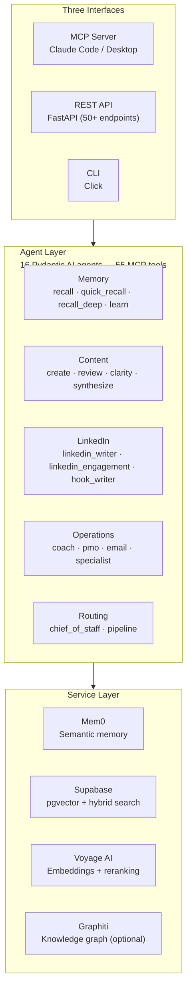
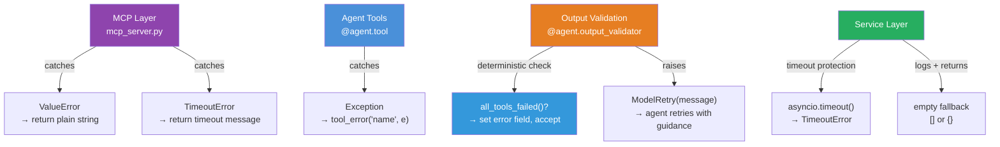

# Second Brain

**Persistent AI memory — your agents remember everything.**

[](LICENSE)
[](https://www.python.org/downloads/)
[](#tests)
[](#mcp-tool-reference)

Your AI forgets everything between sessions. Second Brain fixes that.

16 Pydantic AI agents expose **55 MCP tools** that give Claude (or any MCP client) persistent recall of your decisions, patterns, voice, and priorities — backed by Mem0 semantic memory, Supabase/pgvector hybrid search, and Voyage AI multimodal embeddings. Text, images, PDFs, video — all searchable in one shared vector space.

Three interfaces: **MCP server** for Claude Code, **REST API** (FastAPI, 50+ endpoints) for custom frontends, **CLI** for scripts. Ships with a **Streamlit dashboard** out of the box.

---

## Table of Contents

- [Why This Exists](#why-this-exists)
- [Quickstart](#quickstart)
- [Features](#features)
- [MCP Tool Reference](#mcp-tool-reference)
- [Agents](#agents)
- [Setup](#setup)
- [Docker](#docker)
- [MCP Integration](#mcp-integration)
- [REST API](#rest-api)
- [CLI](#cli)
- [Architecture](#architecture)
- [Data Flow](#data-flow)
- [Service Layer](#service-layer)
- [Advanced Topics](#advanced-topics)
- [Tests](#tests)
- [Tech Stack](#tech-stack)
- [License](#license)

---

## Why This Exists

Every AI session starts from scratch. You re-explain your architecture, re-describe your preferences, re-establish context — every single time.

**Second Brain gives your AI a brain that persists.** Store decisions, recall patterns, generate content in your voice, score your work, get coached on priorities. Everything survives across sessions via hybrid semantic + keyword search with intelligent reranking.

---

## Quickstart

Get running in 3 steps:

### 1. Configure environment

```bash
cd backend
cp .env.example .env
```

Edit `.env` with your keys:
```bash
ANTHROPIC_API_KEY=sk-...       # Or any LLM provider key (OpenAI, Groq, Ollama)
MEM0_API_KEY=m0-...            # Mem0 cloud memory
SUPABASE_URL=https://xxx.supabase.co
SUPABASE_KEY=eyJ...
BRAIN_USER_ID=your-name        # Data isolation identifier
```

### 2. Install and run migrations

```bash
pip install -e ".[dev]"
# Apply all 24 SQL migrations via Supabase dashboard or CLI
# Migrations in: backend/supabase/migrations/ (001–024)
```

### 3. Start

**MCP Server** (for Claude Code):
```bash
python -m second_brain.mcp_server
```

**REST API** (for custom frontends):
```bash
uvicorn second_brain.api.main:app --host 0.0.0.0 --port 8001
```

**Docker** (full stack — MCP + API + Streamlit dashboard):
```bash
docker compose up -d
# MCP: http://localhost:8000  |  API: http://localhost:8001  |  Dashboard: http://localhost:8501
```

All 16 agents and 55 tools are now available. See [MCP Integration](#mcp-integration) for Claude Code/Desktop configuration.

---

## Features

### Memory & Retrieval
- **Complexity-aware recall** — queries auto-route between fast parallel search (~1-2s) and deep agent-driven retrieval (~5-15s) based on query complexity
- **Hybrid search** — combines Mem0 semantic memory, pgvector similarity, and BM25 full-text search with Reciprocal Rank Fusion (RRF)
- **Voyage AI reranking** — results reranked with `rerank-2.5-lite` for precision
- **Multimodal embeddings** — text, images, PDFs, and video indexed in one shared vector space via `voyage-multimodal-3.5`
- **Criteria-based retrieval** — Mem0 v2 criteria retrieval for structured memory filtering
- **Custom instructions** — persistent Mem0 custom instructions for context-aware extraction

### Content & Voice
- **Voice-matched content generation** — creates landing pages, case studies, emails in your writing style
- **Multi-user voice isolation** — 4 users supported (uttam, robert, luke, brainforge) with shared data but isolated voice/style
- **Multi-dimension quality scoring** — 6 parallel reviewers score content across dimensions
- **Content type system** — built-in and custom content types with templates, voice guides, and examples

### LinkedIn & Social
- **LinkedIn post writer** — generates posts matched to your voice with hook variations
- **LinkedIn engagement agent** — creates thoughtful comments for engagement
- **Hook writer** — generates attention-grabbing hooks using proven frameworks

### Operations
- **Daily coaching** — Pomodoro-aware accountability coaching
- **PMO task prioritization** — 5-factor weighted scoring (urgency, impact, effort, alignment, momentum)
- **Project lifecycle** — 5-stage project tracking (planning → executing → reviewing → learning → complete)

### Architecture
- **Pluggable LLM providers** — Anthropic, OpenAI, Groq, Ollama (local + cloud) with automatic fallback chains
- **Pluggable memory providers** — Mem0 (cloud), Graphiti/Neo4j (graph) — switch via config, zero code changes
- **Three interfaces** — MCP server, REST API (FastAPI), CLI — all backed by the same agent layer
- **Streamlit dashboard** — 8-page frontend for chat, memory browsing, content creation, templates, settings

### Resilience
- **Timeout protection** — all service calls have configurable timeouts (default 30s)
- **Retry with backoff** — Tenacity-powered retries with exponential backoff and jitter
- **Deterministic error detection** — validators detect backend failures without relying on LLM instruction-following
- **Graceful degradation** — agents continue with general knowledge when backends are down

---

## MCP Tool Reference

55 tools across 16 agent backends. Tools are grouped by function — use the "When to use" guidance in each tool's description to pick the right one.

### Memory & Recall (6 tools)

| Tool | What it does |
|------|-------------|
| `quick_recall` | Fast parallel search across Mem0 + pgvector (~1-2s). Auto-upgrades complex queries. **Start here for most searches.** |
| `recall` | LLM agent picks the optimal search strategy, can chain searches (~5-15s). For nuanced/ambiguous queries. |
| `recall_deep` | All sources searched concurrently with synthesis (~3-8s). For comprehensive answers. |
| `search_examples` | Browse content examples by type (e.g., "landing-page", "case-study"). |
| `search_knowledge` | Browse knowledge repository by category. |
| `search_experiences` | List past work experiences by category. |

### Search & Data (5 tools)

| Tool | What it does |
|------|-------------|
| `search_patterns` | Query the pattern registry by topic, confidence, keyword. |
| `vector_search` | Direct pgvector similarity search against any table (patterns, examples, knowledge, experiences). |
| `ingest_example` | Add a content example to the library with metadata. |
| `ingest_knowledge` | Add a knowledge entry to the repository. |
| `delete_item` | Delete an item by table and ID. |

### Core Agents (6 tools)

| Tool | What it does |
|------|-------------|
| `ask` | Q&A with full brain context — answers using your stored knowledge, patterns, and experiences. |
| `learn` | Extract patterns and insights from a work session or text. Stores to memory. |
| `create_content` | Generate content (landing pages, emails, case studies) matched to your voice. Accepts `user_id` for multi-user voice. |
| `review_content` | Multi-dimension quality scoring — 6 parallel reviews covering different aspects. Accepts `user_id` for voice-specific review. |
| `consolidate_brain` | Run the Chief of Staff to route a request to the right agent or pipeline. |
| `run_brain_pipeline` | Execute a multi-step agent pipeline (e.g., learn → create → review). |

### LinkedIn & Social (6 tools)

| Tool | What it does |
|------|-------------|
| `create_linkedin_post` | Generate LinkedIn posts in your voice with hook variations and CTA options. |
| `create_linkedin_engagement` | Generate thoughtful comments for LinkedIn posts you want to engage with. |
| `create_hooks` | Generate attention-grabbing hooks using proven frameworks (Question, Bold Claim, Story, Contrarian). |
| `analyze_linkedin_post` | Analyze a LinkedIn post for engagement potential and improvement opportunities. |
| `get_linkedin_templates` | Retrieve LinkedIn post templates and frameworks. |
| `get_hook_frameworks` | List available hook writing frameworks with examples. |

### Graph Memory (7 tools)

| Tool | What it does |
|------|-------------|
| `graph_search` | Search knowledge graph for entity relationships. |
| `graph_health` | Check Graphiti/Neo4j service health and stats. |
| `graph_entity_search` | Find specific entities in the knowledge graph. |
| `graph_entity_context` | Get full context around a known entity. |
| `graph_traverse` | Walk relationships from a starting entity. |
| `graph_communities` | Discover entity clusters and communities. |
| `graph_advanced_search` | Complex graph queries with node/edge type filters and date ranges. |

### Multimodal (4 tools)

| Tool | What it does |
|------|-------------|
| `learn_image` | Analyze and learn from an image (JPEG, PNG, WebP, GIF). |
| `learn_document` | Extract knowledge from a PDF document. |
| `learn_video` | Extract insights from video content. |
| `multimodal_vector_search` | Search across text + image embeddings in one query. |

### Project Lifecycle (9 tools)

| Tool | What it does |
|------|-------------|
| `list_projects` | List all projects with optional lifecycle stage filter. |
| `create_project` | Create a new project with metadata. |
| `project_status` | Get project details including all artifacts. |
| `update_project` | Update project metadata or lifecycle stage. |
| `delete_project` | Delete a project and its artifacts. |
| `advance_project` | Move project to the next lifecycle stage. |
| `add_artifact` | Add an artifact (plan, draft, review, output, note) to a project. |
| `delete_artifact` | Remove an artifact from a project. |
| `pattern_registry` | View the full pattern registry with confidence scores. |

### Operations (5 tools)

| Tool | What it does |
|------|-------------|
| `coaching_session` | Daily accountability coaching with Pomodoro integration. |
| `prioritize_tasks` | PMO-style task prioritization (5-factor weighted scoring). |
| `compose_email` | Compose emails in your brand voice. |
| `ask_claude_specialist` | Claude Code / Pydantic AI domain expert Q&A. |
| `analyze_clarity` | Readability and clarity analysis of text. |

### Content Pipeline (4 tools)

| Tool | What it does |
|------|-------------|
| `synthesize_feedback` | Consolidate review findings into actionable themes. |
| `find_template_opportunities` | Find reusable template opportunities in a deliverable. |
| `brain_health` | Brain metrics — memory count, growth rate, quality trends. |
| `brain_setup` | Check onboarding progress and recommend next steps. |

### Content Types (2 tools)

| Tool | What it does |
|------|-------------|
| `list_content_types` | List all registered content types (built-in and custom). |
| `manage_content_type` | Add or remove a custom content type (built-ins are protected). |

### Growth (1 tool)

| Tool | What it does |
|------|-------------|
| `growth_report` | Generate a growth report showing brain development over time. |

> **Note:** Tool names listed here match exactly what appears in your MCP client. Run `quick_recall` for most searches — it auto-upgrades complex queries to deeper retrieval.

---

## Agents

16 specialized Pydantic AI agents, each with focused responsibilities:

| Agent | File | Purpose |
|-------|------|---------|
| **recall_agent** | `recall.py` | Complexity-aware memory retrieval with hybrid search |
| **ask_agent** | `ask.py` | Q&A with full brain context, graceful degradation |
| **learn_agent** | `learn.py` | Pattern extraction from work sessions, stores to memory |
| **create_agent** | `create.py` | Voice-matched content generation |
| **review_agent** | `review.py` | Multi-dimension quality scoring (6 parallel reviewers) |
| **chief_of_staff** | `chief_of_staff.py` | Request routing and pipeline orchestration |
| **linkedin_writer** | `linkedin_writer.py` | LinkedIn post generation with hook variations |
| **linkedin_engagement** | `linkedin_engagement.py` | Thoughtful LinkedIn comment generation |
| **hook_writer** | `hook_writer.py` | Attention-grabbing hook generation |
| **coach_agent** | `coach.py` | Daily accountability coaching |
| **pmo_agent** | `pmo.py` | PMO-style task prioritization |
| **email_agent** | `email_agent.py` | Email composition in brand voice |
| **specialist_agent** | `specialist.py` | Claude Code / Pydantic AI expert Q&A |
| **clarity_agent** | `clarity.py` | Readability and clarity analysis |
| **synthesizer_agent** | `synthesizer.py` | Feedback consolidation |
| **template_builder** | `template_builder.py` | Template opportunity detection |

Each agent follows the same pattern:
- Defined with `Agent(deps_type=BrainDeps, output_type=Schema, retries=N)`
- Has `@agent.output_validator` for deterministic error detection
- Has `@agent.tool` functions for backend operations
- All tools use `tool_error()` for consistent error handling

---

## Setup

### 1. Install

```bash
cd backend
pip install -e ".[dev]"              # Core + dev dependencies
pip install -e ".[dev,graphiti]"     # + Graphiti knowledge graph (optional)
pip install -e ".[dev,subscription]" # + Claude subscription auth (optional)
```

### 2. Environment

```bash
cp .env.example .env
```

**Required:**

| Variable | Description |
|----------|-------------|
| `SUPABASE_URL` | Your Supabase project URL |
| `SUPABASE_KEY` | Supabase anon/service key |
| `BRAIN_USER_ID` | User identifier for data isolation |
| `BRAIN_DATA_PATH` | Path to your markdown data files |

**LLM Provider** (at least one required):

| Variable | Default | Description |
|----------|---------|-------------|
| `MODEL_PROVIDER` | `auto` | `auto`, `anthropic`, `ollama-local`, `ollama-cloud`, `openai`, `groq` |
| `ANTHROPIC_API_KEY` | — | Claude models (default if `auto`) |
| `OPENAI_API_KEY` | — | GPT models; also used by Mem0 for internal embeddings |
| `GROQ_API_KEY` | — | Groq fast inference |
| `OLLAMA_BASE_URL` | `http://localhost:11434` | Ollama (local or cloud) |

`MODEL_PROVIDER=auto` detects available keys: Anthropic → Ollama Cloud → Ollama Local.

**Memory** (required for full functionality):

| Variable | Default | Description |
|----------|---------|-------------|
| `MEM0_API_KEY` | — | Mem0 cloud API key (required for MemoryService) |
| `MEMORY_PROVIDER` | `mem0` | `mem0` or `graphiti` |

**Multi-User Voice Isolation:**

| Variable | Default | Description |
|----------|---------|-------------|
| `ALLOWED_USER_IDS` | `uttam,robert,luke,brainforge` | Comma-separated list of valid user IDs for voice isolation |

**Optional:**

| Variable | Default | Description |
|----------|---------|-------------|
| `VOYAGE_API_KEY` | — | Voyage AI embeddings + reranking |
| `BRAIN_API_KEY` | `""` | REST API auth key (empty = no auth) |
| `MCP_TRANSPORT` | `stdio` | `stdio`, `http`, `streamable-http` |
| `GRAPHITI_ENABLED` | `false` | Enable Graphiti knowledge graph |
| `NEO4J_URL` | — | Required if `MEMORY_PROVIDER=graphiti` |
| `MODEL_FALLBACK_CHAIN` | `""` | Comma-separated fallback providers |
| `AGENT_MODEL_OVERRIDES` | `{}` | JSON dict for per-agent model selection |
| `SERVICE_TIMEOUT_SECONDS` | `30` | Timeout for all service calls |

See `.env.example` for the complete list with descriptions.

### 3. Database Migrations

Apply all 24 migrations via Supabase dashboard or CLI:

```bash
# Migrations in: backend/supabase/migrations/
# Numbered 001 through 024
```

Key migrations:
- `001–010`: Core tables (patterns, experiences, examples, knowledge, projects)
- `011–015`: Quality gates, content types, vault support
- `016–018`: User isolation (RLS policies, user_id columns)
- `019`: HNSW vector indexes + GIN tag indexes
- `020–024`: Hybrid search RPC, additional hardening

### 4. Start

```bash
# MCP Server (Claude Code / Desktop)
python -m second_brain.mcp_server

# REST API (custom frontends)
uvicorn second_brain.api.main:app --host 0.0.0.0 --port 8001

# CLI
brain --help
```

---

## Docker

### Full Stack (Backend + Frontend)

```bash
docker compose up -d          # Start everything
docker compose up -d backend  # Backend only (MCP + API)
docker compose up -d frontend # Frontend only
docker compose logs -f        # View logs
docker compose down           # Stop everything
```

| Service | Port | Purpose |
|---------|------|---------|
| `backend` | 8000 | MCP server (HTTP transport) |
| `backend` | 8001 | REST API (FastAPI) |
| `frontend` | 8501 | Streamlit dashboard |

Both containers run as non-root users. Backend uses a multi-stage uv build for fast, reproducible installs. Frontend starts only after backend health check passes.

<details>
<summary>Transport configuration and health checks</summary>

### Transport Configuration

The server supports three transport modes via the `MCP_TRANSPORT` environment variable:

| Transport | `MCP_TRANSPORT=` | Use Case |
|-----------|-----------------|----------|
| **stdio** | `stdio` (default) | Local development — Claude Code spawns as subprocess |
| **HTTP** | `http` | Docker / network — single `/mcp` endpoint, stateless |
| **Streamable HTTP** | `streamable-http` | Alias for `http` (same behavior in FastMCP 2.x) |

Additional env vars for HTTP mode:

```bash
MCP_HOST=0.0.0.0   # Bind address (default: 0.0.0.0)
MCP_PORT=8000       # Port (default: 8000, range: 1024-65535)
```

### Health Check

When running in HTTP mode, a deep health endpoint is available:

```bash
curl http://localhost:8000/health
# Healthy: {"status": "healthy", "service": "second-brain", "initialized": true}
# Unhealthy (503): {"status": "unhealthy", "service": "second-brain", "error": "..."}
```

Docker's `restart: unless-stopped` policy handles automatic recovery when the health check fails.

</details>

---

## MCP Integration

### Local (stdio)

Add to your MCP config (`.mcp.json` or `claude_desktop_config.json`):

```json
{
  "mcpServers": {
    "second-brain": {
      "command": "python",
      "args": ["-m", "second_brain.mcp_server"],
      "cwd": "/path/to/repo/backend"
    }
  }
}
```

Works with Claude Code, Cursor, Windsurf, and any other MCP-compatible client.

### Docker (HTTP) — Claude Code

```bash
claude mcp add --transport http second-brain http://localhost:8000/mcp
```

Or add to `.mcp.json`:

```json
{
  "mcpServers": {
    "second-brain": {
      "type": "http",
      "url": "http://localhost:8000/mcp"
    }
  }
}
```

### Docker (HTTP) — Claude Desktop

Claude Desktop requires the `mcp-remote` proxy to connect to HTTP MCP servers:

```json
{
  "mcpServers": {
    "second-brain": {
      "command": "npx",
      "args": ["mcp-remote", "http://localhost:8000/mcp"]
    }
  }
}
```

### Usage Examples

Once connected, all 55 tools are available naturally:

```
Use quick_recall to find everything I know about authentication patterns.

Learn this pattern from my code: [paste code]

Create a LinkedIn post in my voice about shipping this feature.

Review this draft and score it across all dimensions.

Coach me — what should I be focused on today?
```

LinkedIn engagement:

```
Create a LinkedIn post about launching our new AI feature.

Write an engaging comment for this LinkedIn post: [paste post]

Generate 5 hook variations for: "We just shipped the biggest update in company history"
```

Multi-user voice:

```
Create content as robert: Draft an email about the Q4 roadmap.

Review this draft using luke's voice standards.
```

---

## REST API

FastAPI server with 50+ endpoints. Start with:

```bash
uvicorn second_brain.api.main:app --host 0.0.0.0 --port 8001
```

Auth: Set `BRAIN_API_KEY` in `.env`. Pass as `X-API-Key` header. Empty = no auth required.

### Endpoints

| Group | Path | Methods | Description |
|-------|------|---------|-------------|
| Health | `/api/health/*` | GET | Metrics, growth, milestones, quality, setup status (no auth) |
| Agents | `/api/recall`, `/api/ask`, `/api/learn`, etc. | POST | All 16 agents as REST endpoints |
| Memory | `/api/search/*`, `/api/ingest/*` | GET/POST | Search examples, knowledge, patterns, experiences; ingest content |
| Projects | `/api/projects/*` | CRUD | Project lifecycle management with artifacts |
| Graph | `/api/graph/*` | GET/POST | Knowledge graph search and health |
| Settings | `/api/settings/*` | GET | Active config and provider info |
| Content Types | `/api/content-types` | GET/POST | Manage content type registry |
| Templates | `/api/templates/*` | GET | Template bank access |
| Items | `/api/items/{table}/{id}` | DELETE | Delete items by table and ID |

Interactive docs at `http://localhost:8001/docs` (Swagger UI).

---

## CLI

```bash
brain --help            # Show available commands
brain migrate           # Run data migration
brain health            # Check brain health
```

---

## Architecture



```
backend/src/second_brain/
├── mcp_server.py          # 55 MCP tools (FastMCP 2.x)
├── api/                   # REST API (FastAPI)
│   ├── main.py            # App factory, middleware, CORS
│   └── routers/           # 8 route modules
├── agents/                # 16 Pydantic AI agents (one per file)
│   ├── recall.py          # Complexity-aware recall with hybrid search
│   ├── ask.py, learn.py   # Core knowledge agents
│   ├── create.py          # Voice-matched content generation
│   ├── review.py          # Multi-dimension scoring
│   ├── chief_of_staff.py  # Routing orchestrator
│   ├── linkedin_writer.py # LinkedIn post generation
│   ├── linkedin_engagement.py # LinkedIn comment generation
│   ├── hook_writer.py     # Hook generation
│   └── ...                # coach, pmo, email, specialist, clarity, synthesizer, template_builder
├── services/              # External service wrappers
│   ├── memory.py          # Mem0 semantic memory (retry + timeout hardened)
│   ├── storage.py         # Supabase CRUD + hybrid search + ContentTypeRegistry
│   ├── embeddings.py      # Voyage AI embedding generation
│   ├── voyage.py          # Voyage AI reranking
│   ├── graphiti.py        # Neo4j knowledge graph (optional)
│   ├── graphiti_memory.py # Graphiti ↔ MemoryServiceBase adapter (timeout hardened)
│   └── abstract.py        # MemoryServiceBase ABC (14 methods)
├── providers/             # LLM provider registry
│   ├── __init__.py        # BaseProvider ABC + PROVIDER_REGISTRY
│   └── anthropic.py, ollama.py, openai.py, groq.py
├── config.py              # BrainConfig (Pydantic Settings)
├── schemas.py             # All Pydantic output models
├── deps.py                # BrainDeps + create_deps() factory
└── models.py              # Model factory (provider + fallback chains)
```

---

## Data Flow

### Learn → Store → Recall


### Error Handling & Resilience

Three-tier error handling ensures agents never crash — they degrade gracefully:



**Deterministic error detection**: All memory-using agents (Recall, Ask, Learn) parse `ctx.messages` for tool outputs and call `all_tools_failed()`. When all backends are down, they set the `error` field and return immediately — no retry spirals.

---

## Service Layer

Agents never talk to databases directly. External systems do the heavy lifting through a clean service abstraction — swappable at runtime via `MEMORY_PROVIDER`.

| Service | Purpose |
|---------|---------|
| `memory.py` | Mem0 wrapper — add, search, and retrieve semantic memories. Retry/timeout hardened via Tenacity. Supports multimodal content, criteria retrieval, and custom instructions |
| `storage.py` | Supabase wrapper — CRUD for all structured data, hybrid search (BM25 + pgvector), `ContentTypeRegistry` for content type configs |
| `embeddings.py` | Embedding generation via Voyage AI (primary) or OpenAI (fallback). Supports multimodal inputs via `embed_multimodal()` |
| `voyage.py` | Voyage AI reranking + multimodal embeddings — `voyage-multimodal-3.5` embeds text, images, and video into a shared 1024-dim vector space |
| `graphiti.py` | Knowledge graph via Graphiti + FalkorDB — entity and relationship extraction (optional) |
| `graphiti_memory.py` | Adapts Graphiti to the `MemoryServiceBase` interface — complete drop-in replacement for Mem0, all 14 methods implemented with timeout protection |
| `health.py` | Brain metrics, growth milestones, and system health checks |
| `retry.py` | Tenacity retry decorators for transient failures |
| `abstract.py` | Abstract base classes (`MemoryServiceBase`, etc.) for pluggable service implementations + stub services for testing |

---

## Advanced Topics

### Pluggable Memory Providers

| Provider | Backend | Config |
|----------|---------|--------|
| `mem0` (default) | Mem0 Cloud | `MEMORY_PROVIDER=mem0` + `MEM0_API_KEY` |
| `graphiti` | Neo4j knowledge graph | `MEMORY_PROVIDER=graphiti` + Neo4j vars |

All providers implement `MemoryServiceBase` (14 abstract methods). Switching is a config change — no code changes needed.

### Multi-User Voice Isolation

| User ID | Voice Profile |
|---------|---------------|
| `uttam` | Primary user voice |
| `robert` | Alternative voice 1 |
| `luke` | Alternative voice 2 |
| `brainforge` | Brand voice |

Shared data: memories, patterns, knowledge. Isolated per user: voice, writing style, content examples.

Use `user_id` parameter on MCP tools:
```
Create content as robert: Draft an email about the roadmap.
```

### Multimodal Support

| Content Type | Formats | Tool |
|-------------|---------|------|
| Images | JPEG, PNG, WebP, GIF | `learn_image` |
| Documents | PDF | `learn_document` |
| Video | Various | `learn_video` |
| Mixed search | Text + image | `multimodal_vector_search` |

Embeddings via Voyage `voyage-multimodal-3.5` — all content types share one vector space.

### LLM Provider Fallback

Configure fallback chains for resilience:

```bash
MODEL_PROVIDER=anthropic
MODEL_FALLBACK_CHAIN=openai,ollama-local
```

If Anthropic fails, tries OpenAI, then local Ollama. Per-agent overrides:
```bash
AGENT_MODEL_OVERRIDES={"recall": "openai:gpt-4o", "create": "anthropic:claude-sonnet-4-5"}
```

---

## Tests

```bash
cd backend
pytest                          # All tests (1706+)
pytest tests/test_agents.py     # Single file
pytest -k "test_recall"         # Filter by name
pytest -x                       # Stop on first failure
```

31 test files covering agents, services, MCP tools, API endpoints, providers, config, CLI, and graph operations. Key test areas:

- **Agent tests**: Validator behavior, error detection, output schemas
- **Service tests**: Mem0, Supabase, Voyage AI, Graphiti integration
- **MCP tests**: All 55 tools, input validation, timeout handling
- **API tests**: REST endpoints via FastAPI TestClient
- **Provider tests**: LLM provider registry, fallback chains

Test count is tracked per commit (e.g., "1706 tests passing"). Never reduce count without explanation.

---

## Tech Stack

| Layer | Technology |
|-------|-----------|
| Language | Python 3.11+ |
| Agent Framework | Pydantic AI |
| MCP Server | FastMCP 2.x |
| REST API | FastAPI |
| Memory | Mem0 (cloud) |
| Database | Supabase (PostgreSQL + pgvector) |
| Embeddings | Voyage AI (`voyage-multimodal-3.5`) |
| Reranking | Voyage AI (`rerank-2.5-lite`) |
| Knowledge Graph | Graphiti + Neo4j/FalkorDB (optional) |
| Frontend | Streamlit |
| CLI | Click |
| LLM Providers | Anthropic, OpenAI, Groq, Ollama |
| Retries | Tenacity |
| Config | Pydantic Settings |

---

## License

MIT — see [LICENSE](LICENSE).
