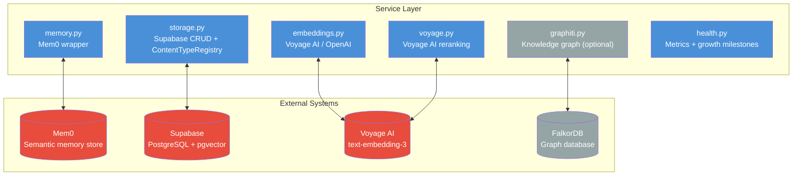

# Second Brain

**A personal AI memory and knowledge system — exposed as an MCP server for Claude Code.**

13 Pydantic AI agents backed by Mem0 semantic memory, Supabase/pgvector, and Voyage AI embeddings. Your AI remembers what you've built, what you've learned, and how you think — across every session.

[](LICENSE)

---

## The Problem

Most AI sessions start from zero. You re-explain your architecture, re-describe your voice, re-establish your preferences — every time. The AI that helped you build your auth system last week has no idea it exists today.

**Second Brain fixes that.** It gives Claude Code a persistent memory layer: store decisions, recall patterns, generate content in your voice, score your work, and get coaching on your priorities. Everything persists across sessions via semantic search, not keyword matching.

---

## How It Works


---

## The 13 Agents

### Memory Agents — Store and retrieve knowledge across sessions


| Agent | What It Does |
|-------|-------------|
| `recall` | Semantic search across everything stored in memory — surfaces relevant past decisions, patterns, and notes |
| `ask` | Answers questions using full brain context — connects your stored knowledge to new questions |
| `learn` | Extracts patterns and insights from anything you feed it (notes, code, articles) and stores them |

### Content Agents — Generate and score content in your voice


| Agent | What It Does |
|-------|-------------|
| `create` | Generates content (posts, docs, emails, code comments) with awareness of your stored voice and style examples |
| `review` | Scores content across multiple dimensions: clarity, structure, impact, tone — returns dimension-by-dimension scores |
| `clarity` | Readability analysis — identifies passive voice, jargon, complex sentences, and structural issues |
| `synthesizer` | Consolidates feedback from multiple sources (review scores, clarity issues, your notes) into a single prioritized action list |
| `template_builder` | Detects when you're repeating a pattern and proposes a reusable template |

### Operations Agents — Manage priorities and communications


| Agent | What It Does |
|-------|-------------|
| `coach` | Daily accountability coaching — surfaces your top priorities, checks progress against goals, prompts reflection |
| `pmo` | PMO-style task prioritization — manages competing projects, deadlines, and resource constraints |
| `email_agent` | Composes emails matched to your voice and the relationship context of the recipient |

### Specialist Agent

| Agent | What It Does |
|-------|-------------|
| `specialist` | Deep Q&A on Claude Code, Pydantic AI, and the Second Brain system itself — uses stored knowledge of your setup |

---

## Service Layer

Three external systems do the actual work. Agents call them through a clean service abstraction.



| Service | Purpose |
|---------|---------|
| `memory.py` | Wraps Mem0 — add, search, and retrieve semantic memories with embedding-based similarity |
| `storage.py` | Wraps Supabase — CRUD for all structured data + `ContentTypeRegistry` for content type configs |
| `embeddings.py` | Generates embeddings via Voyage AI (primary) or OpenAI (fallback) for vector search |
| `voyage.py` | Voyage AI reranking — re-orders search results by relevance after initial retrieval |
| `graphiti.py` | Optional knowledge graph via Graphiti + FalkorDB — entity and relationship extraction |
| `health.py` | Brain metrics, growth milestones, and system health checks |
| `retry.py` | Tenacity retry decorators for transient failures |
| `search_result.py` | Shared data structures for search results across all retrieval methods |
| `abstract.py` | Abstract base classes for pluggable service implementations |

---

## Data Flow

### Learn → Store → Recall


### Error Handling


---

## Tech Stack

| Component | Technology |
|-----------|-----------|
| Language | Python 3.11+ |
| Agent framework | Pydantic AI (`pydantic-ai[anthropic]`) |
| MCP server | FastMCP |
| Semantic memory | Mem0 (`mem0ai`) |
| Database | Supabase (PostgreSQL + pgvector) |
| Embeddings | Voyage AI (primary), OpenAI (fallback) |
| Knowledge graph | Graphiti + FalkorDB (optional, `GRAPHITI_ENABLED=false`) |
| CLI | Click (`brain` entrypoint) |
| Retries | Tenacity |
| Config | Pydantic Settings (loads `.env` via `BrainConfig`) |
| Testing | pytest + pytest-asyncio (`asyncio_mode = "auto"`) |

---

## Setup

### 1. Environment

```bash
cd backend
cp .env.example .env
```

Edit `.env`:

```bash
ANTHROPIC_API_KEY=...       # Required — powers all agents
MEM0_API_KEY=...            # Required — semantic memory store
SUPABASE_URL=...            # Required — structured storage + vector search
SUPABASE_KEY=...            # Required — Supabase service role key
VOYAGE_API_KEY=...          # Optional — falls back to OpenAI embeddings
GRAPHITI_ENABLED=false      # Set true to enable knowledge graph (needs FalkorDB)
```

### 2. Install

```bash
cd backend
pip install -e ".[dev]"
```

Optional extras:

```bash
pip install -e ".[dev,graphiti]"      # + Graphiti knowledge graph
pip install -e ".[dev,subscription]"  # + Claude Agent SDK (subscription auth)
pip install -e ".[dev,ollama]"        # + Ollama local model support
```

### 3. Database Migrations

Apply migrations in order via the Supabase dashboard or CLI. All 14 migrations are in `backend/supabase/migrations/`, numbered `001` through `014`.

```
001_initial_schema.sql         — Core tables
002_examples_knowledge.sql     — Examples and knowledge tables
003_pattern_constraints.sql    — Pattern uniqueness constraints
004_content_types.sql          — Content type registry
005_growth_tracking_tables.sql — Growth and milestone tracking
006_rls_policies.sql           — Row Level Security policies
007_foreign_keys_indexes.sql   — Foreign keys and indexes
008_data_constraints.sql       — Data validation constraints
009_reinforce_pattern_rpc.sql  — Pattern reinforcement RPC
010_vector_search_rpc.sql      — pgvector similarity search RPC
011_voyage_dimensions.sql      — Voyage AI embedding dimensions
012_projects_lifecycle.sql     — Project lifecycle tables
013_quality_trending.sql       — Quality score trending
014_content_type_instructions.sql — Content type prompt instructions
```

### 4. Start the MCP Server

```bash
cd backend
python -m second_brain.mcp_server
```

All 13 agents are now available as MCP tools inside Claude Code.

---

## MCP Integration

Add to your Claude Code MCP config (`.mcp.json` or `claude_desktop_config.json`):

```json
{
  "mcpServers": {
    "second-brain": {
      "command": "python",
      "args": ["-m", "second_brain.mcp_server"],
      "cwd": "/path/to/repo/backend"
    }
  }
}
```

Once connected, you can call any agent from Claude Code:

```
Use the second brain to recall everything I know about Supabase RLS.

Learn this pattern from my code: [paste code]

Create a LinkedIn post in my voice about shipping this feature.

Review this draft and score it across all dimensions.

Coach me — what should I be focused on today?
```

You can also manage projects and knowledge directly:

```
List all my active projects.

Update project "auth-system" — mark it as shipped.

Search my stored experiences for anything related to Supabase migrations.

Search patterns — find everything I've learned about rate limiting.

Ingest this example into my brain: [paste code or content]

Add an artifact to project "second-brain" — link to this PR.

Ingest this knowledge entry: [paste article, doc, or note]
```

---

## CLI

Direct access without the MCP layer:

```bash
brain --help         # Show all commands
brain health         # Check brain health and growth milestones
brain migrate        # Run data migration
```

---

## Code Structure

```
backend/
├── src/second_brain/
│   ├── mcp_server.py          # Public surface: @server.tool() functions
│   ├── service_mcp.py         # Supplemental service routing
│   ├── deps.py                # BrainDeps dataclass + create_deps() factory
│   ├── config.py              # BrainConfig (Pydantic Settings, loads .env)
│   ├── schemas.py             # All Pydantic output models (no internal imports)
│   ├── models.py              # AI model selection logic
│   ├── models_sdk.py          # Claude SDK model support
│   ├── auth.py                # Authentication helpers
│   ├── migrate.py             # Data migration utilities
│   ├── cli.py                 # Click CLI ("brain" command)
│   ├── agents/
│   │   ├── chief_of_staff.py  # Routing orchestrator
│   │   ├── recall.py
│   │   ├── ask.py
│   │   ├── learn.py
│   │   ├── create.py
│   │   ├── review.py
│   │   ├── coach.py
│   │   ├── pmo.py
│   │   ├── email_agent.py
│   │   ├── specialist.py
│   │   ├── clarity.py
│   │   ├── synthesizer.py
│   │   ├── template_builder.py
│   │   └── utils.py           # Shared: tool_error(), run_pipeline(), format_*()
│   └── services/
│       ├── memory.py          # Mem0 semantic memory wrapper
│       ├── storage.py         # Supabase CRUD + ContentTypeRegistry
│       ├── embeddings.py      # Voyage AI / OpenAI embedding generation
│       ├── voyage.py          # Voyage AI reranking
│       ├── graphiti.py        # Knowledge graph (optional)
│       ├── health.py          # Brain metrics + growth milestones
│       ├── retry.py           # Tenacity retry helpers
│       ├── search_result.py   # Search result data structures
│       └── abstract.py        # Abstract base classes
├── supabase/migrations/       # 14 SQL migrations (001–014)
├── tests/                     # ~843 tests (one file per module)
├── scripts/                   # Utility scripts
├── .env.example               # Documented env var template
└── pyproject.toml             # Dependencies + pytest config
```

---

## Tests

```bash
cd backend
pytest                              # All tests (~843)
pytest tests/test_agents.py         # Single file
pytest -k "test_recall"             # Filter by name
pytest -x                           # Stop on first failure
pytest -v                           # Verbose output
```

One test file per source module. All async tests run without `@pytest.mark.asyncio` — `asyncio_mode = "auto"` in `pyproject.toml`.

---

## By the Numbers

| Component | Count |
|-----------|-------|
| Pydantic AI agents | 13 |
| MCP tools | 38 |
| Service layer modules | 9 |
| Database migrations | 14 |
| Test files | 20 |
| Tests | ~843 |
| Python version | 3.11+ |

---

## License

[MIT](LICENSE)
