# My Coding System

**Stop guessing. Start engineering.**

A complete development methodology that turns AI from an unpredictable autocomplete into a disciplined engineering partner. Built for [Claude Code](https://claude.com/claude-code), powered by the PIV Loop, and battle-tested across real projects.

[](LICENSE)

---

## The Problem

AI coding tools are powerful, but without structure they produce inconsistent results. Give the AI too little context and it guesses. Give it too much and it drowns. Ask it to build a feature without a plan and you get code that works in isolation but breaks everything around it.

Most developers use AI like a magic 8-ball: ask a question, hope for a good answer, and manually clean up when it isn't.

**This system fixes that.**

It manages context automatically, enforces a plan-first workflow, and gives you quality gates at every stage. The result: AI that produces production-grade code on the first try, not the fifth.

---

## What This Is (and Isn't)

This is **not** an application. There's no source code, no build system, no runtime.

This is a **development methodology** — a structured collection of slash commands, templates, reference guides, and automation that wraps around Claude Code and turns it into a reliable development workflow. You clone this system, then build your applications inside it (or copy it into existing projects).

**What you get:**
- 21 slash commands that automate every phase of development
- 19 templates for plans, PRDs, agents, and validation reports
- 26 reference guides loaded on-demand (not wasting context tokens)
- 12 pre-built AI subagents for research, code review, and specialist tasks
- 5 cloud skills for parallel implementation and GitHub automation
- 3 GitHub Action workflows for AI-assisted issue resolution
- A token-conscious architecture that keeps <10K tokens of system context, leaving the rest for your actual work

---

## The PIV Loop

Every feature follows the same cycle: **Plan**, **Implement**, **Validate**, then iterate.

```mermaid
graph LR
    subgraph "PIV Loop"
        direction LR
        P["🎯 PLAN<br/>/planning<br/><i>Opus recommended</i>"]
        I["⚡ IMPLEMENT<br/>/execute<br/><i>Sonnet recommended</i>"]
        V["✅ VALIDATE<br/>/code-review<br/><i>4 Haiku agents</i>"]
        C["📦 COMMIT<br/>/commit"]

        P --> I --> V
        V -->|"Issues found"| FIX["/code-review-fix"]
        FIX --> V
        V -->|"All clear"| C
    end

    VIBE["💬 Vibe Planning<br/>conversation"] -->|"distill"| P
    P -->|"produces"| PLAN["📄 requests/<br/>feature-plan.md"]
    PLAN -->|"fresh session"| I
    C -->|"iterate"| NEXT["Next PIV Loop"]

    style P fill:#4a90d9,color:#fff
    style I fill:#7b68ee,color:#fff
    style V fill:#e67e22,color:#fff
    style C fill:#27ae60,color:#fff
```



**Plan** — Start with a vibe planning conversation, then distill it into a structured plan document (500-700 lines of context-rich implementation instructions). The plan captures everything the AI needs: architecture decisions, file paths, code patterns, gotchas, and step-by-step tasks.

**Implement** — Execute the plan in a fresh conversation. Clean context means better output. The AI follows the plan task-by-task instead of improvising.

**Validate** — Code review, testing, and human review. Issues loop back to planning. A 5-level validation pyramid catches problems from syntax errors to architectural violations.

The key insight: **multiple small PIV loops** — one feature slice per loop, built completely before moving on. Complex features auto-decompose into sub-plans.

---

## System Architecture

Context is organized in layers. Auto-loaded context stays minimal so the AI has maximum context window for actual work. Deep guides load on-demand only when relevant.

```mermaid
graph TD
    subgraph "Auto-Loaded Context (~2K tokens)"
        CLAUDE["📋 CLAUDE.md"] --> S["sections/<br/>6 core rules"]
    end

    subgraph "On-Demand Context (loaded when needed)"
        R["📚 reference/<br/>26 deep guides"]
        T["📝 templates/<br/>19 templates"]
    end

    subgraph "Automation Layer"
        CMD["⚙️ .claude/commands/<br/>21 slash commands"]
        AG["🤖 .claude/agents/<br/>12 subagents"]
        SK["☁️ .claude/skills/<br/>5 cloud skills"]
    end

    subgraph "External Integrations"
        MEM["🧠 memory.md<br/>cross-session context"]
        ARCHON["🗄️ Archon MCP<br/>(optional)<br/>tasks + RAG"]
        GH["🔄 GitHub Actions<br/>3 workflows<br/>8 prompt templates"]
    end

    CLAUDE -.->|"on-demand"| R
    CLAUDE -.->|"on-demand"| T
    CMD -->|"reads"| T
    CMD -->|"spawns"| AG
    SK -.->|"loads"| R
    MEM -.-> CMD
    ARCHON -.-> CMD
    CMD -->|"produces"| REQ["📄 requests/<br/>feature plans"]
    REQ -->|"/execute"| IMPL["⚡ Implementation"]
    IMPL -->|"/code-review"| AG
    IMPL -->|"/commit"| GIT["📦 Git Save Points"]
    GIT -->|"push"| GH

    style CLAUDE fill:#4a90d9,color:#fff
    style CMD fill:#7b68ee,color:#fff
    style AG fill:#e67e22,color:#fff
    style IMPL fill:#27ae60,color:#fff
```



### Token Budget

The system manages context tokens carefully:

| Layer | Token Cost | Loading |
|-------|-----------|---------|
| `CLAUDE.md` + 6 sections | ~2K tokens | Auto-loaded every session |
| Slash commands | varies | Loaded only when invoked |
| Reference guides (26) | varies | On-demand only |
| Templates (19) | varies | On-demand only |
| **Typical session total** | **<10K tokens** | Leaves ~100K+ for implementation |

---

## Quick Start

### Prerequisites
- [Claude Code CLI](https://claude.com/claude-code) installed
- Git configured

### Setup

1. **Clone** this repo:
   ```bash
   git clone https://github.com/ryanjosebrosas/my-coding-system-claude.git
   cd my-coding-system-claude
   ```

2. **Create your memory file** from the template:
   ```bash
   cp templates/MEMORY-TEMPLATE.md memory.md
   ```

3. **Start Claude Code** and prime the system:
   ```bash
   claude
   > /prime
   ```

4. **Plan your first feature**:
   ```
   > /planning user-authentication
   ```

5. **Execute the plan** (in a fresh session for clean context):
   ```
   > /execute requests/user-authentication-plan.md
   ```

6. **Review and commit**:
   ```
   > /code-review
   > /commit
   ```

### First Time?
Start with `/prime` to load context, then try `/planning` on a small feature. Read `reference/file-structure.md` for a full map of everything included.

---

## Adopting for Your Project

### Option A: Use as Your Project Base (Recommended for new projects)
Fork or clone this repo, then build your application inside it. All slash commands, templates, and reference guides are ready to go.

### Option B: Copy Into an Existing Project
```bash
cp -r sections/ reference/ templates/ requests/ your-project/
cp CLAUDE.md AGENTS.md .coderabbit.yaml your-project/
cp -r .claude/ your-project/
cp templates/MEMORY-TEMPLATE.md your-project/memory.md
```

Then run `/init-c` to customize `CLAUDE.md` for your project's tech stack.

### After Setup
- `memory.md` — Created from template, gitignored. Each developer maintains their own.
- `requests/*.md` — Feature plans, gitignored. Ephemeral by design.
- `.claude/settings.local.json` — Personal Claude Code settings, gitignored.

---

## Model Strategy

The system separates thinking from doing. Use the right model for each phase:

| Phase | Recommended Model | Why |
|-------|-------------------|-----|
| `/planning` | **Opus** (`claude --model opus`) | Deep reasoning produces better plans |
| `/execute` | **Sonnet** (`claude` default) | Balanced — follows plans well at lower cost |
| `/code-review` | **Haiku** (via subagents) | Pattern matching at a fraction of the cost |
| `/commit`, `/prime` | **Sonnet** (`claude` default) | General-purpose tasks |

```bash
# Planning session (Opus for deep reasoning)
claude --model opus
> /planning my-feature

# Execution session (Sonnet for focused implementation)
claude
> /execute requests/my-feature-plan.md
```

See `reference/multi-model-strategy.md` for the full cost optimization guide.

---

## All 21 Slash Commands

### Core Workflow

These six commands cover 90% of daily development:

| Command | What It Does | When to Use |
|---------|-------------|-------------|
| `/prime` | Loads codebase context, reads memory, checks active tasks | Start of every session |
| `/planning [feature]` | 6-phase deep analysis producing a structured plan document | Before building any feature |
| `/execute [plan]` | Implements a plan file task-by-task with validation | After planning, in a fresh session |
| `/commit` | Creates a conventional-format git commit | After implementation passes review |
| `/code-review` | Runs 4 parallel review agents (type safety, security, architecture, performance) | After implementation |
| `/code-review-fix` | Applies fixes from code review findings | After code review surfaces issues |

### Advanced Workflows

For parallel development, multi-agent builds, and automation:

| Command | What It Does | When to Use |
|---------|-------------|-------------|
| `/end-to-end-feature` | Full autonomous pipeline: plan, implement, review, commit | Trusted, well-defined features |
| `/team [plan]` | Coordinates multiple Claude instances with contract-first spawning | Complex features needing parallel agents |
| `/new-worktree` | Creates isolated git worktrees for parallel branches | Multi-feature parallel development |
| `/merge-worktrees` | Merges worktree branches back with validation gates | After parallel implementation |
| `/parallel-e2e` | Runs multiple end-to-end features in parallel via worktrees | Batch feature development |

### Utilities

| Command | What It Does | When to Use |
|---------|-------------|-------------|
| `/rca [issue]` | Root cause analysis for a GitHub issue | Investigating bugs |
| `/implement-fix` | Implements a fix based on an RCA document | After root cause analysis |
| `/create-prd` | Generates a Product Requirements Document from conversation | Defining a new product or major feature |
| `/create-pr` | Creates a GitHub Pull Request with AI-generated description | After pushing a branch |
| `/execution-report` | Generates a post-implementation report for system review | Reviewing what was built vs. what was planned |
| `/init-c` | Generates a customized `CLAUDE.md` for a new project | New project setup |
| `/agents` | Creates a new custom subagent definition file | Extending the system with new agents |
| `/system-review` | Audits system state for divergence between plan and reality | Periodic system health checks |
| `/setup-github-automation` | Full GitHub Actions and secrets configuration | First-time GitHub automation setup |
| `/quick-github-setup` | Streamlined GitHub automation using existing scripts | Fast GitHub setup |

---

## 12 Subagents

Pre-installed in `.claude/agents/`, organized by purpose. Each agent runs in isolation with its own context window, so expensive research doesn't pollute your implementation context.

### Research Agents

| Agent | Model | Purpose |
|-------|-------|---------|
| `research-codebase` | Haiku | Parallel codebase exploration — finds files, extracts patterns, reports findings |
| `research-external` | Sonnet | Documentation search, best practices, version compatibility checks |

### Code Review Agents

These four run in parallel during `/code-review`, each checking a different dimension:

| Agent | Model | What It Catches |
|-------|-------|----------------|
| `code-review-type-safety` | Haiku | Missing type hints, type checking errors, unsafe casts |
| `code-review-security` | Haiku | SQL injection, XSS, exposed secrets, insecure data handling |
| `code-review-architecture` | Haiku | Pattern violations, layer breaches, convention drift |
| `code-review-performance` | Haiku | N+1 queries, inefficient algorithms, memory leaks, unnecessary computation |

### Utility Agents

| Agent | Model | Purpose |
|-------|-------|---------|
| `plan-validator` | Haiku | Validates plan structure and completeness before `/execute` |
| `test-generator` | Haiku | Analyzes changed code and suggests test cases following project patterns |

### Specialist Agents

Deeper expertise for domain-specific tasks:

| Agent | Model | Purpose |
|-------|-------|---------|
| `specialist-devops` | Sonnet | CI/CD pipelines, Docker, IaC, monitoring, deployments |
| `specialist-data` | Sonnet | Database design, migrations, queries, data pipelines |
| `specialist-copywriter` | Sonnet | UI copy, microcopy, error messages, UX writing |
| `specialist-tech-writer` | Sonnet | API docs, READMEs, changelogs, architecture documentation |

See `reference/subagents-overview.md` for creating your own agents.

---

## 5 Cloud Skills

Cloud skills extend the system with MCP-powered capabilities:

| Skill | Purpose |
|-------|---------|
| `agent-teams` | Coordinated multi-agent implementation with contract-first spawning |
| `planning-methodology` | 6-phase systematic planning with parallel research |
| `worktree-management` | Git worktree lifecycle for parallel feature branches |
| `parallel-implementation` | End-to-end parallel development via worktrees and headless instances |
| `github-automation` | GitHub Actions setup, CodeRabbit integration, workflow configuration |

---

## 19 Templates

Reusable templates for every artifact the system produces:

### Planning & Requirements
| Template | Purpose |
|----------|---------|
| `STRUCTURED-PLAN-TEMPLATE.md` | Main planning template — covers all 4 Context Engineering pillars |
| `SUB-PLAN-TEMPLATE.md` | Sub-feature plans for complex decomposition |
| `PLAN-OVERVIEW-TEMPLATE.md` | High-level plan overview |
| `PRD-TEMPLATE.md` | Product Requirements Document |
| `VIBE-PLANNING-GUIDE.md` | Guide for casual-to-structured planning conversations |

### Validation
| Template | Purpose |
|----------|---------|
| `VALIDATION-PROMPT.md` | Validation execution prompt |
| `VALIDATION-REPORT-TEMPLATE.md` | Structured findings report |
| `META-REASONING-CHECKLIST.md` | Reasoning checklist for plan review |
| `BASELINE-ASSESSMENT-TEMPLATE.md` | Project baseline assessment |

### System Extension
| Template | Purpose |
|----------|---------|
| `AGENT-TEMPLATE.md` | Create custom subagent definitions |
| `COMMAND-TEMPLATE.md` | Create new slash commands |
| `SKILL-TEMPLATE.md` | Create MCP cloud skills |
| `TOOL-DOCSTRING-TEMPLATE.md` | Document tool parameters |
| `CREATE-REFERENCE-GUIDE-PROMPT.md` | Generate new reference guides |

### Project Setup
| Template | Purpose |
|----------|---------|
| `MEMORY-TEMPLATE.md` | Cross-session memory file |
| `NEW-PROJECT-CHECKLIST.md` | New project setup steps |
| `GITHUB-SETUP-CHECKLIST.md` | GitHub Actions and CodeRabbit setup |
| `IMPLEMENTATION-PROMPT.md` | Implementation work prompt |
| `TEAM-SPAWN-PROMPTS.md` | Agent Teams coordination prompts |

---

## 26 Reference Guides

Deep documentation loaded on-demand — never wasting context tokens until you need them:

### Core Methodology
| Guide | What It Covers |
|-------|---------------|
| `system-foundations.md` | Why this system exists, baseline assessment, trust progression |
| `piv-loop-practice.md` | PIV Loop in practice with real examples |
| `planning-methodology-guide.md` | 6-phase planning methodology, PRD, Vertical Slice Architecture |
| `implementation-discipline.md` | `/execute` design, Navigate-Implement-Verify, save states |
| `validation-strategy.md` | Validation planning and structure |
| `validation-discipline.md` | 5-level validation pyramid |
| `global-rules-optimization.md` | Layer 1 optimization, `@sections` modular organization |

### Context & Architecture
| Guide | What It Covers |
|-------|---------------|
| `layer1-guide.md` | Setting up CLAUDE.md for a new project |
| `file-structure.md` | Complete file location reference |
| `multi-model-strategy.md` | Model selection and cost optimization |

### Agents & Extensions
| Guide | What It Covers |
|-------|---------------|
| `subagents-overview.md` | Creating and managing subagents |
| `subagents-guide.md` | Detailed subagent creation guide |
| `subagents-deep-dive.md` | Parallel execution and context isolation |
| `agent-teams-overview.md` | Multi-agent coordination and `/team` command |
| `command-design-overview.md` | Slash command design philosophy |
| `command-design-framework.md` | INPUT-PROCESS-OUTPUT command framework |
| `mcp-skills-overview.md` | MCP servers and cloud skill configuration |
| `mcp-skills-archon.md` | MCP, skills, and Archon integration |

### DevOps & Automation
| Guide | What It Covers |
|-------|---------------|
| `github-integration.md` | GitHub Actions and CodeRabbit setup |
| `github-orchestration.md` | GitHub as AI orchestration layer, 3 integration approaches |
| `git-worktrees-overview.md` | Parallel implementation with worktrees |
| `git-worktrees-parallel.md` | Deep worktree guide with parallelization patterns |
| `archon-workflow.md` | Archon task management and RAG search |

### Remote & Advanced
| Guide | What It Covers |
|-------|---------------|
| `remote-system-overview.md` | Remote coding agent architecture |
| `remote-system-guide.md` | Remote system setup and deployment |
| `remote-agentic-system.md` | Remote AI coding system design |

---

## Agent Teams

For features too complex for a single Claude instance, Agent Teams coordinates multiple instances with **contract-first spawning** — upstream agents publish interfaces before downstream agents start building.

```bash
# Plan the feature (Opus recommended for deep reasoning)
claude --model opus
> /planning my-feature

# Execute with a coordinated team (Sonnet recommended for speed)
> /team requests/my-feature-plan.md
```

The system handles team sizing, task decomposition, spawn prompts, and WSL+tmux orchestration automatically. See `reference/agent-teams-overview.md` for the full architecture.

---

## GitHub Automation

### Included Workflows

| Workflow | Trigger | What It Does |
|----------|---------|-------------|
| `claude-fix.yml` | `@claude-fix` comment on issue/PR | AI investigates and fixes the issue on a branch |
| `coderabbit-approval-notify.yml` | CodeRabbit approves a PR | Notifies when automated review passes |
| `coderabbit-auto-merge.yml` | CodeRabbit submits review | Auto-merges PRs that pass automated review |

### 8 Workflow Prompt Templates

Pre-built prompts in `.github/workflows/prompts/` that give GitHub Actions Claude instances the same structured methodology:

`prime-github.md` | `plan-feature-github.md` | `execute-github.md` | `rca-github.md` | `implement-fix-github.md` | `bug-fix-github.md` | `code-review-github.md` | `end-to-end-feature-github.md`

### Setup

1. Add `CLAUDE_CODE_OAUTH_TOKEN` to repo secrets
2. Add `AUTHORIZED_USERS` as a repository variable: `["your-username"]`
3. Copy workflows to `.github/workflows/`
4. Optionally configure `.coderabbit.yaml` for automated PR reviews

See `reference/github-integration.md` for the full setup guide, or run `/setup-github-automation` for automated configuration.

---

## Context Engineering: The 4 Pillars

Every structured plan is built on four pillars that ensure the AI has exactly what it needs:

| Pillar | What It Provides | Plan Section |
|--------|-----------------|-------------|
| **Memory** | Past decisions and gotchas from `memory.md` | Related Memories |
| **RAG** | External docs, library references, codebase patterns | Relevant Documentation, Patterns to Follow |
| **Prompt Engineering** | Explicit decisions, step-by-step detail, reduced ambiguity | Solution Statement, Implementation Plan |
| **Task Management** | Atomic tasks with files, actions, and validation criteria | Step-by-Step Tasks |

The balance matters. Too little context and the AI guesses wrong. Too much and it loses focus. The structured plan template (`templates/STRUCTURED-PLAN-TEMPLATE.md`) enforces this balance by mapping each pillar to specific sections.

---

## Core Principles

| Principle | What It Means |
|-----------|-------------|
| **YAGNI** | Only implement what's needed right now. No speculative features. |
| **KISS** | Prefer simple, readable solutions over clever abstractions. |
| **DRY** | Extract common patterns, but don't over-abstract. |
| **Limit AI Assumptions** | Be explicit in plans and prompts. Less guessing = better output. |
| **Always Be Priming (ABP)** | Start every session with `/prime`. Context is everything. |

---

## Optional: Archon MCP

[Archon MCP](https://github.com/coleam00/archon) provides task management and RAG search across sessions. **Completely optional** — all commands work without it. When available, it adds:

- Persistent task tracking across planning and execution sessions
- RAG search over curated documentation sources
- Project and version management

See `reference/archon-workflow.md` for setup instructions.

---

## Project Structure

```
My-Coding-System/
├── CLAUDE.md                          # Auto-loaded rules (~2K tokens)
├── AGENTS.md                          # Agent guidance for AI assistants
├── LICENSE                            # MIT License
├── .coderabbit.yaml                   # CodeRabbit PR review configuration
├── .gitignore                         # Protects secrets, memory, plans
├── memory.md                          # Cross-session memory (gitignored)
│
├── sections/                          # Core methodology (6 files, auto-loaded)
│   ├── 01_core_principles.md          #   YAGNI, KISS, DRY, ABP
│   ├── 02_piv_loop.md                 #   Plan-Implement-Validate cycle
│   ├── 03_context_engineering.md      #   4 pillars of context
│   ├── 04_git_save_points.md          #   Commit strategy
│   ├── 05_decision_framework.md       #   Autonomy vs. ask
│   └── 06_archon_workflow.md          #   Task management integration
│
├── reference/                         # Deep guides (26 files, on-demand)
│   ├── system-foundations.md
│   ├── planning-methodology-guide.md
│   ├── multi-model-strategy.md
│   ├── ...22 more guides...
│   └── github-workflows/              # Workflow reference files
│
├── templates/                         # Reusable templates (19 files)
│   ├── STRUCTURED-PLAN-TEMPLATE.md
│   ├── PRD-TEMPLATE.md
│   ├── AGENT-TEMPLATE.md
│   └── ...16 more templates...
│
├── requests/                          # Feature plans (gitignored)
│
├── .claude/
│   ├── commands/                      # Slash commands (21 commands)
│   │   ├── prime.md
│   │   ├── planning.md
│   │   ├── execute.md
│   │   ├── commit.md
│   │   └── ...17 more commands...
│   ├── agents/                        # Custom subagents (12 agents)
│   │   ├── research-codebase.md
│   │   ├── code-review-security.md
│   │   ├── specialist-devops.md
│   │   └── ...9 more agents...
│   └── skills/                        # Cloud skills (5 skills)
│       ├── agent-teams/
│       ├── planning-methodology/
│       ├── worktree-management/
│       ├── parallel-implementation/
│       └── github-automation/
│
└── .github/
    └── workflows/                     # GitHub Actions automation
        ├── claude-fix.yml
        ├── coderabbit-approval-notify.yml
        ├── coderabbit-auto-merge.yml
        └── prompts/                   # 8 workflow prompt templates
```

---

## By the Numbers

| Component | Count |
|-----------|-------|
| Core methodology sections | 6 |
| Reference guides | 26 |
| Reusable templates | 19 |
| Slash commands | 21 |
| Subagents | 12 |
| Cloud skills | 5 |
| GitHub Action workflows | 3 |
| Workflow prompt templates | 8 |
| **Total system files** | **~100** |
| Auto-loaded context cost | ~2K tokens |
| Typical session context | <10K tokens |

---

## License

This project is licensed under the [MIT License](LICENSE).
